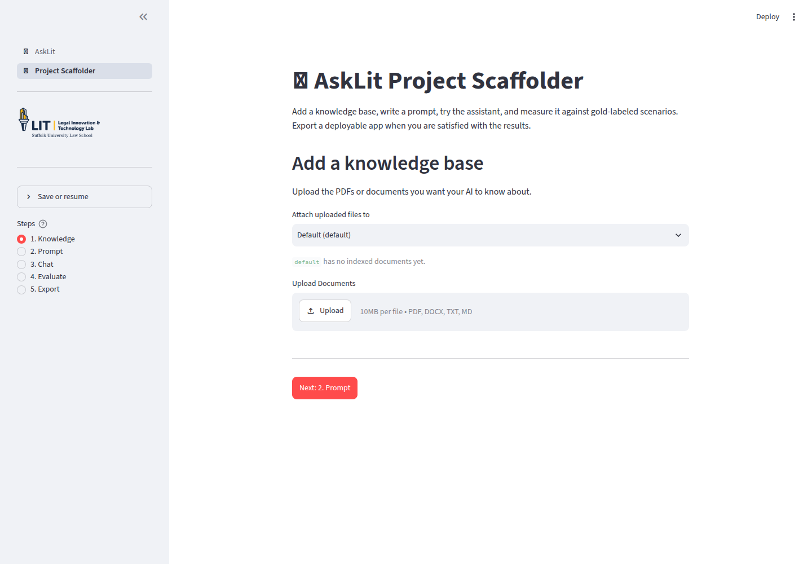
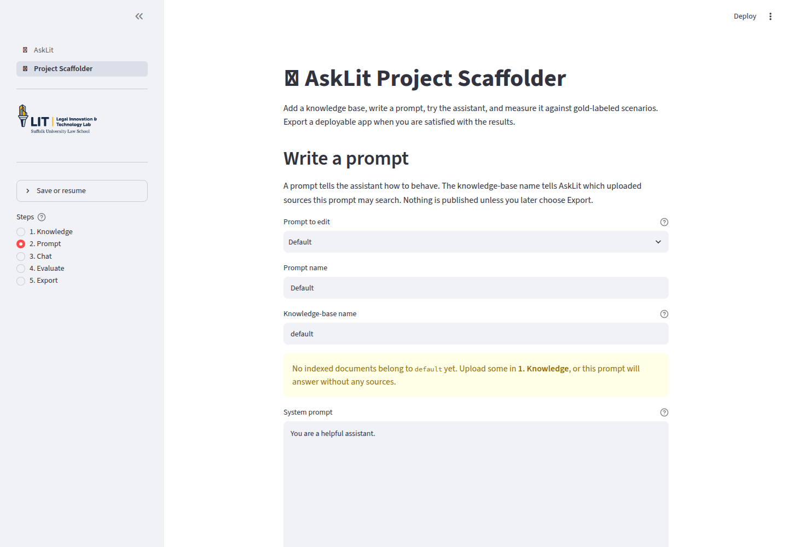
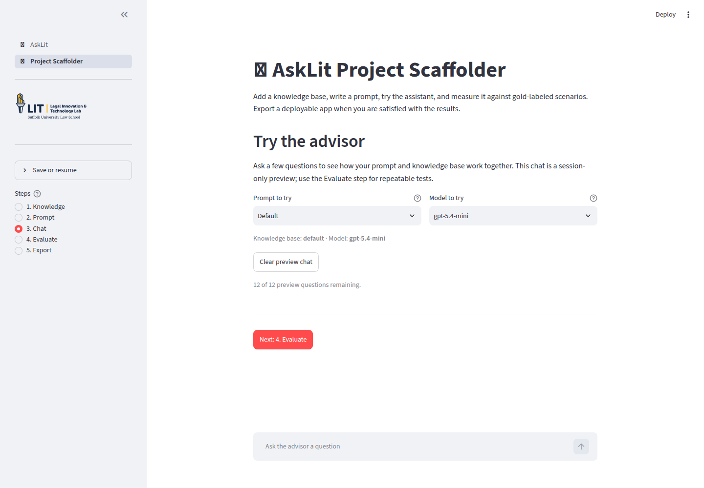

# Build an AskLIT

The [AskLIT basics](/docs/asklits/overview) page explains the three building
blocks: a system prompt, an optional knowledge base, and a chat. This page shows
where those pieces appear in the Project Scaffolder.

The first three screens configure the assistant:

1. **Knowledge:** What information may the assistant use?
2. **Prompt:** What should the assistant do with that information?
3. **Chat:** Does it behave the way you intended?

The Scaffolder also has Evaluate and Export screens, covered in the
[evaluation](/docs/asklits/evaluating) and
[deployment](/docs/asklits/deploying) pages.

## Open the Project Scaffolder

Open the Scaffolder supplied by your instructor or organization. The sidebar
contains the five steps and a **Save or resume** panel.

Some installations require a shared password before Chat or Evaluate can make
model calls. Uploading documents and editing prompts do not require a
password. The password gate protects a shared model budget.

For a first project, follow this order:

1. Add a small source packet, if your task needs one.
2. Write one focused prompt.
3. Try several questions in Chat.
4. Save any surprising questions for evaluation.

## 1. Knowledge: add source documents



### Choose a prompt profile

Use **Attach uploaded files to** to choose a prompt profile. A new workspace
starts with one `Default` profile and a `default` knowledge-base name. If you
create multiple profiles, this selector connects uploaded documents
to the intended assistant.

### Upload and index

AskLIT accepts PDF, DOCX, TXT, and Markdown files.

1. Select one or more files under **Upload Documents**.
2. Choose **Process & Index Documents**.
3. Wait for the confirmation message.
4. Confirm that the files appear under the selected knowledge base.

Indexing extracts text, splits it into passages, and creates the searchable
representation used by Chat and Evaluate.

AskLIT reports files that were indexed, skipped, or rejected. A duplicate file
is skipped instead of indexed twice.

### Choose good source material

Use documents that are:

- Current and approved
- Text-based rather than image-only scans
- Organized with clear headings
- Explicit about dates, exceptions, and definitions
- Focused so relevant passages are easy to retrieve

For a clinical exercise, a source packet might contain a fictional intake sheet,
a short statute or regulation excerpt, a clinic protocol, a referral list, and
an assignment rubric. Never upload confidential client information; see
[Ethical guidelines and data privacy](/docs/asklits/ethics) for data safety rules.
Give files clear names such as `fictional-client-packet.pdf`.

### Why this step matters

The knowledge base limits what the app can retrieve. It does not make the model
an expert, and it does not guarantee that every relevant passage will be found.
Keep the collection small and verify the sources yourself.

:::warning

**A source packet is not a source-of-truth guarantee.** Retrieval can miss a
relevant passage or surface a distracting one. In clinical exercises, teach
students to open **Sources used**, verify the passage, and note when the packet
does not answer the question.

:::

If the Prompt screen reports that the knowledge base is empty, verify that you
uploaded the files to the same profile and that the knowledge-base name matches.

## 2. Prompt: give the app a job



The Prompt screen controls the app’s behavior. A useful prompt defines the role,
intended audience, specific task, communication style, and boundaries.

### Main fields

| Field | What it means |
| --- | --- |
| **Prompt to edit** | Switch between prompt profiles. |
| **Prompt name** | The label users will see, such as `Interviewing coach`. |
| **Knowledge-base name** | The source collection this prompt may search. |
| **System prompt** | The standing instructions for the assistant. |
| **Conversation starters** | Example questions displayed as quick-start buttons. |

### A simple prompt recipe

Keep initial prompts short and direct. A useful structure is:

1. Role
2. Audience
3. Task
4. Source boundary
5. Answer style
6. Safety limits

Make instructions concrete so behavior is easy to verify:

| Vague instruction | Concrete instruction |
| --- | --- |
| "Be helpful." | "Give the user two practical next steps in plain language." |
| "Know the lease." | "Use only the uploaded fictional lease and checklist. Name the section supporting each point." |
| "Be careful with legal questions." | "Do not decide whether a real lease is valid. Identify terms to review and state what facts are missing." |
| "Sound like a client." | "Reveal facts only when asked an appropriate question. Stay in role until the user requests a debrief." |

Good prompts also tell the app what to do when information is missing:
"If the source packet does not answer the question, state that clearly and suggest what professional help to seek."

Do not paste entire source documents into the prompt text. Upload those as
knowledge-base files instead. Prompts supply instructions; knowledge bases supply facts.

Example simulation prompt:

```text
You are a simulated client in a law-school interviewing exercise.

Use only the fictional client packet in the knowledge base. Reveal facts
naturally and only when the student asks an appropriate question. Do not
volunteer legal analysis or tell the student what question to ask next.

Stay in role unless the student asks for a debrief. During a debrief, identify
missed facts, unanswered safety questions, and judgmental language.
Give specific, respectful feedback tied to the exercise rubric.

This is a fictional educational simulation. Do not provide legal advice about
real people or real cases.
```

### Add another prompt

Choose **Add another prompt** when a single published app should offer multiple
modes. For example:

- `Simulated client`
- `Research coach`
- `Supervisor feedback`

Each profile maintains its own prompt text, knowledge-base name, and conversation
starters.

### Advanced pairing controls

Open **Advanced: deployment details for this prompt** to see the YAML key and
the **Connected files** selector.

Connected files narrow a prompt to specific files within its knowledge base. If
all files are selected, the profile searches the entire knowledge base,
including files added later.

### Why this step matters

The same underlying model can act as an intake client, a research coach, or a
supervisor. The prompt defines that persona and gives you an inspectable text
block to refine when output needs correction.

## 3. Chat: try the app



Chat provides a session-only preview for exploratory testing:

- Use **Prompt to try** to switch profiles.
- Use **Model to try** to compare approved models.
- Try available conversation starters.
- Open **Sources used** under responses to inspect filenames, page numbers, and
  retrieved excerpts.
- If no passages appear, check indexing status, connected files, and search terms.
- Use **Clear preview chat** before testing a new scenario.

The preview allows twelve questions per conversation by default to protect shared class model budgets.

### Questions to try

During preview chat, test how the assistant handles direct answers, missing facts, and safety boundaries. Note any surprising or failing responses, as these make ideal test cases when building formal scenarios in [Evaluate an AskLIT](/docs/asklits/evaluating).

## Save and resume

Open **Save or resume** in the sidebar to download a workspace YAML file. It stores
settings, prompts, conversation starters, scenarios, and shared rubrics. It does
not store API keys, document text, vector indexes, branding images, or
generated answers.

When importing a workspace, AskLIT lists any documents or branding files that
must be re-uploaded before running Chat or Evaluate.
