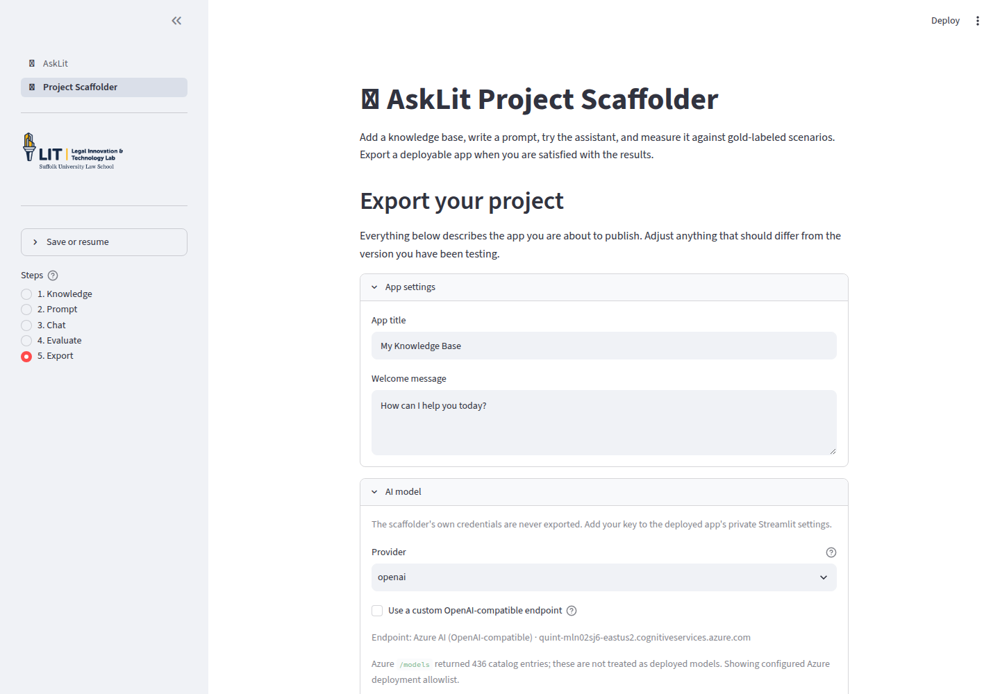

# Deploy an AskLIT with GitHub and Streamlit

The Scaffolder saves deployment settings for the final step. First build and test the
assistant, then use Export to package the project for GitHub and Streamlit Community Cloud.

## Export is a final review

The Export screen configures the published app. You can return to earlier screens to adjust prompts or documents before exporting.

### App settings

Set the public **App title** and **Welcome message**. Clarify what the tool does and does not do. For a clinic simulation, specify that it is an educational simulation.

### AI model

Select the provider and default model. The Scaffolder’s administrative credentials are
never exported. When deploying the generated app, add your API key to Streamlit's private secrets.

If your institution provides an API gateway or approved model list, use those values.

### Access and branding

Choose **Public** or **Password Protected** access, and decide whether to enable the admin backend. You can also configure a custom logo, favicon, homepage URL, and footer text.

When you set an access or administrator password, AskLIT hashes it before storing. Use distinct passwords for visitors and administrators.

### Review the project

The Export screen summarizes:

- Prompt profiles and conversation starters
- Knowledge bases, document counts, and connected files
- Evaluation scenarios, rubrics, and recent pass rates

Evaluation scenarios and test runs are not bundled into the exported chatbot.
Save the workspace YAML or download the results CSV to preserve your test history.

### Deployment settings and secrets

The **Deployment settings & secrets** panel generates a pre-formatted TOML block for Streamlit Cloud.

Never put real API keys in:

- A system prompt
- An uploaded document
- A public code repository
- A class assignment submission

## Publish the project

### Option A: Download a ZIP

Choose **Prepare ZIP Download** to download the complete runtime package. You can manually upload the files to GitHub or host them on your own server.

### Option B: Push to GitHub

Choose **Connect to GitHub**. AskLIT uses GitHub's OAuth device code flow:

1. Keep the AskLIT window open.
2. Open the GitHub authorization link provided by the Scaffolder.
3. Enter the one-time code.
4. Approve repository permissions.
5. Return to AskLIT and confirm authorization.

Name the repository and select public or private visibility. If public, all indexed knowledge-base documents will be publicly accessible.

## Deploy with Streamlit Community Cloud

Streamlit Community Cloud hosts the generated app directly from GitHub:

1. Open [Streamlit Community Cloud](https://share.streamlit.io/) and sign in with the GitHub account that owns the repository.
2. Choose **Create app**.
3. Select your generated repository.
4. Set the branch to `main`.
5. Set **Main file path** to `app.py`.
6. Choose your desired app URL.
7. Open **Advanced settings**.
8. Paste your configuration into the private **Secrets** box.
9. Choose **Deploy**.

Initial dependency installation may take a few minutes. Once live, test a question requiring knowledge-base retrieval to verify that sources are functioning properly.

For a working reference, explore the [AskLIT Clinical Skills Gallery](https://asklit-clinical-skills-gallery-5hokdmbr8cbcyztuvkeaty.streamlit.app/) and select Haiku helper, Lease lens, or Interviewing client from the sidebar. The [gallery page](./gallery) explains the design of each profile.

## Ownership and privacy

The published GitHub repository and deployed Streamlit app belong to your accounts. Keep secrets private and rotate API keys if accidentally committed.

For guidance on API provider data policies, enterprise Zero Data Retention (ZDR), and HIPAA compliance, see [Ethical guidelines and data privacy](./ethics).
