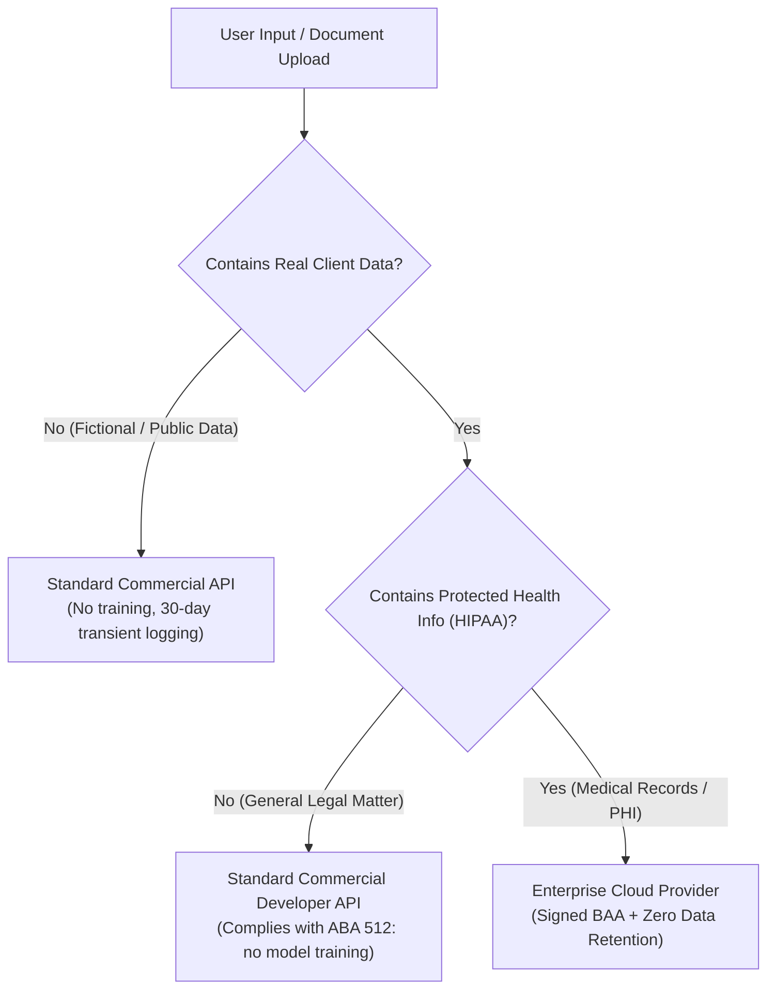

# Ethical guidelines and data privacy

When building AskLITs for legal education, legal aid, or clinic workflows, protecting confidential information and understanding provider data policies are fundamental requirements.

This guide explains how commercial AI providers handle data, how legal ethics rules (including ABA Formal Opinion 512) apply, and when specialized regulatory frameworks like HIPAA come into play.

---

## Data privacy and API training policies

A common concern with AI applications is whether uploaded documents and user questions will be used to train future models.

### Consumer web chats vs. developer APIs

There is a critical distinction between consumer chat interfaces and developer APIs:

- **Consumer web interfaces** (such as standard consumer web versions of ChatGPT, Claude, or Gemini) often enable model training on user conversations by default unless the user opts out.
- **Commercial developer APIs** (such as the OpenAI API, Anthropic API, Google Cloud Vertex AI, and Microsoft Azure OpenAI) **do not train on your API inputs or outputs out of the box**.

As long as your AskLIT connects to standard commercial APIs using an API key or enterprise endpoint, your data is not used to train future models unless you explicitly opt in to data sharing or custom fine-tuning programs.

### Data retention and abuse monitoring

Although standard commercial developer APIs do not train on your data, most providers retain API logs temporarily (typically for 15 to 30 days) on secure servers strictly for abuse and misuse monitoring, after which logs are deleted.

This transient logging is standard across cloud software and does **not** involve model training or third-party exposure.

---

## Legal ethics and ABA Formal Opinion 512

The American Bar Association's [Formal Opinion 512: Generative Artificial Intelligence Tools](https://www.americanbar.org/content/dam/aba/administrative/professional_responsibility/ethics-opinions/aba-formal-opinion-512.pdf) (see also the [ABA Ethics Opinions archive](https://www.americanbar.org/groups/professional_responsibility/publications/ethics_opinions/)) addresses a lawyer's duty of confidentiality under Model Rule 1.6 when using generative AI.

The primary confidentiality concern under Opinion 512 is whether an AI tool "learns" from client information, meaning the system retains or uses confidential data to train future models or could expose that information to other users.

Because commercial developer APIs do not train on API inputs or outputs by default:

- **Using a standard commercial developer API generally satisfies the core confidentiality concern regarding "learning" AI systems**, because the model does not train on or assimilate your data.
- **Transient abuse logging (15 to 30 days) does not violate ethical rules under Opinion 512**, provided the attorney exercises reasonable due diligence regarding the vendor's security, privacy terms, and reliability.

---

## When is Zero Data Retention (ZDR) needed? (HIPAA & PHI)

**Zero Data Retention (ZDR)** is an enterprise configuration where the cloud provider disables even temporary abuse logging, processing prompts strictly in memory and discarding them immediately.

ZDR is **not** required for standard legal ethics compliance under ABA Opinion 512. In practice, ZDR is almost exclusively offered for specialized regulatory regimes, particularly **HIPAA** (the Health Insurance Portability and Accountability Act):

### HIPAA and Business Associate Agreements (BAAs)

If an AskLIT processes Protected Health Information (PHI), such as medical records in a disability clinic, domestic violence triage with health disclosures, or personal injury matters, HIPAA regulations apply:

- Standard pay-as-you-go commercial developer API accounts are **not HIPAA-compliant by default**.
- You must use an enterprise cloud provider (such as Microsoft Azure OpenAI, AWS Bedrock, or Google Cloud Vertex AI) and execute a formal **Business Associate Agreement (BAA)** before transmitting PHI.
- Providers typically bundle or require **Zero Data Retention (ZDR)** as part of their enterprise HIPAA/BAA compliance package.
- All other components in the hosting stack (such as Streamlit hosting and application databases) must also satisfy HIPAA physical, technical, and administrative safeguards.

---

## Safe starting rules for law school clinics

For law-school courses, clinical simulations, and student projects, adopting a "safe by design" approach simplifies development and avoids unnecessary risk:

### 1. Use fictional or public source material
- Build knowledge bases from public statutes, court forms, government handbooks, published case opinions, or intentionally fictional case files.
- Avoid uploading unredacted client names, addresses, dates of birth, Social Security numbers, or privileged client communications to student or public projects.

### 2. Guard secrets and credentials
- Never paste API keys into system prompts, uploaded documents, or public code repositories.
- In AskLIT, export credentials into Streamlit Cloud's private **Secrets** panel only.
- If a GitHub repository is public, all documents bundled into its knowledge base are publicly viewable.

### 3. Maintain human supervision
- An AskLIT is an educational and workflow tool, not a licensed attorney.
- In student simulations, prompts should instruct users to consult a licensed supervising attorney or instructor for real matters.
- Design single-turn tools to produce issue checklists, practical questions, and guidance rather than unsupervised legal conclusions.

### 4. Verify citations and retrieval
- LLMs can generate persuasive text that misstates facts or cites non-existent authorities.
- Teach students to open **Sources used** in AskLIT Chat, confirm retrieved passages against primary sources, and note when the source packet does not contain the answer.

---

## Summary checklist

| Context | Data Handling & Compliance |
| :--- | :--- |
| **Model Training** | Standard commercial developer APIs **do not train** on your data out of the box. |
| **Legal Ethics (ABA 512)** | Using non-training commercial APIs satisfies the duty of confidentiality regarding "learning" AI systems. Standard 15 to 30 day transient abuse logging is permissible with reasonable vendor due diligence. |
| **Protected Health Info (HIPAA)** | Requires an enterprise cloud provider, a signed **Business Associate Agreement (BAA)**, and a **Zero Data Retention (ZDR)** agreement. |
| **Classroom & Clinic Projects** | Best practice is to use fictional case packets, public authorities, and de-identified materials. |
| **Supervision** | Maintain human-in-the-loop oversight from a supervising attorney or instructor for all legal work. |
