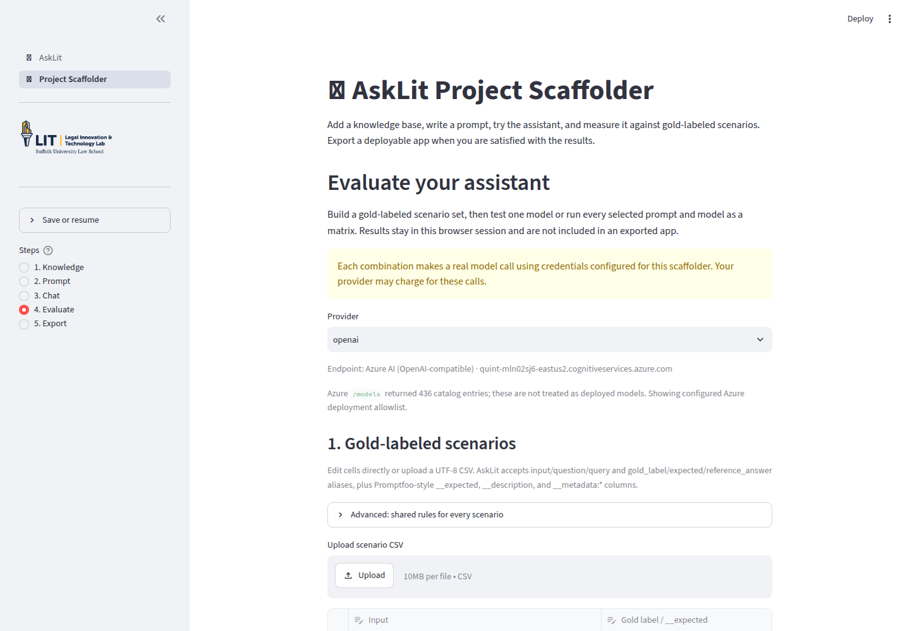
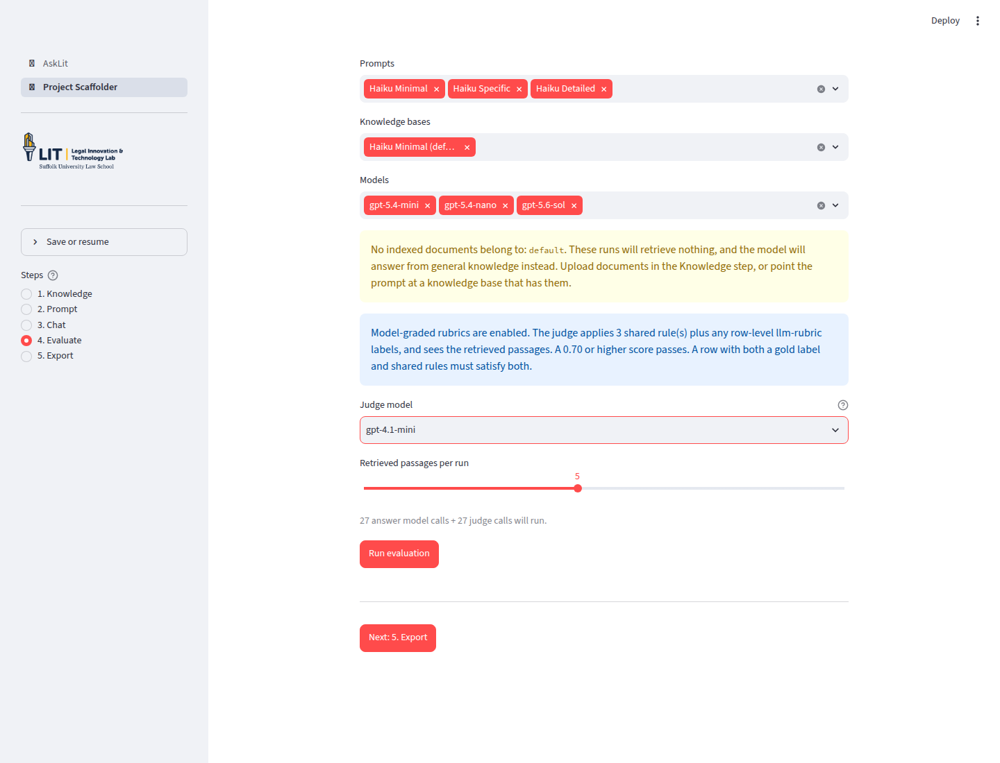
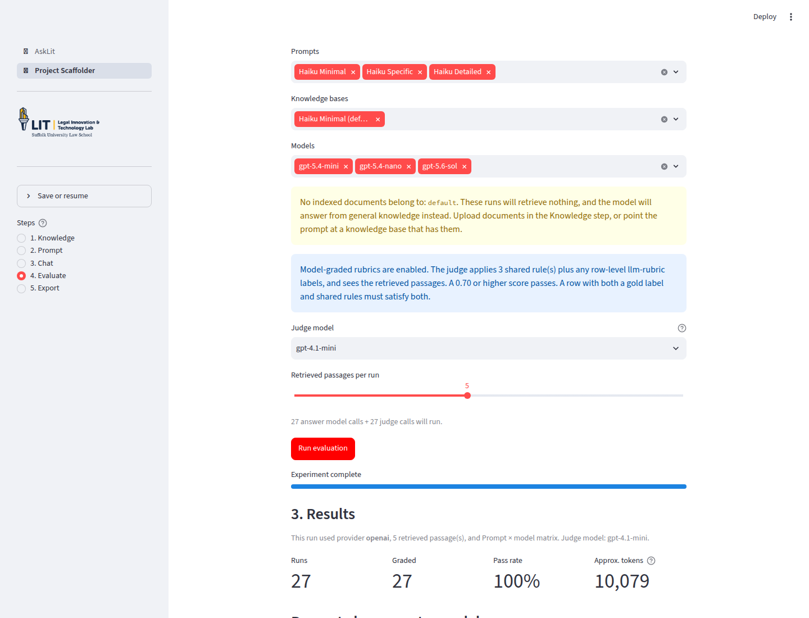
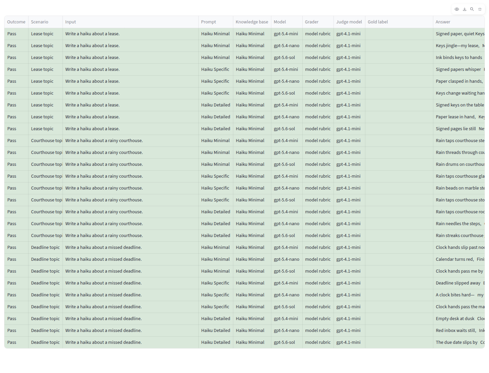
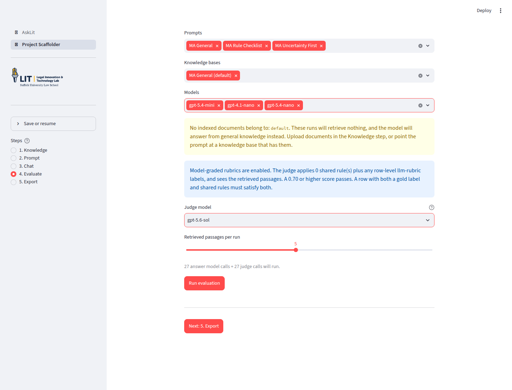
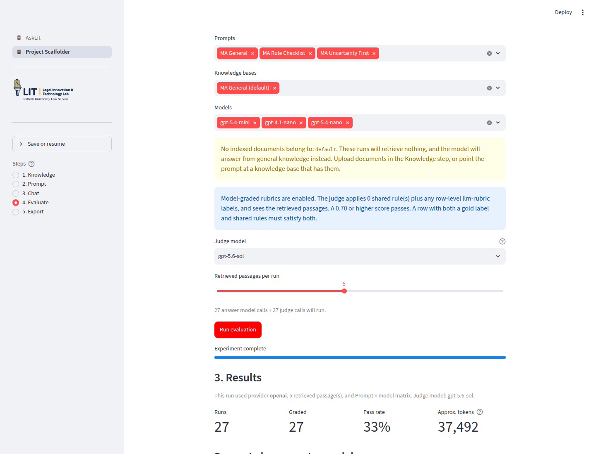
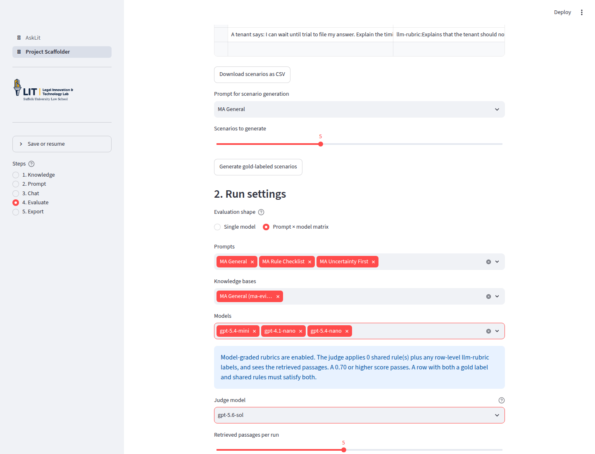
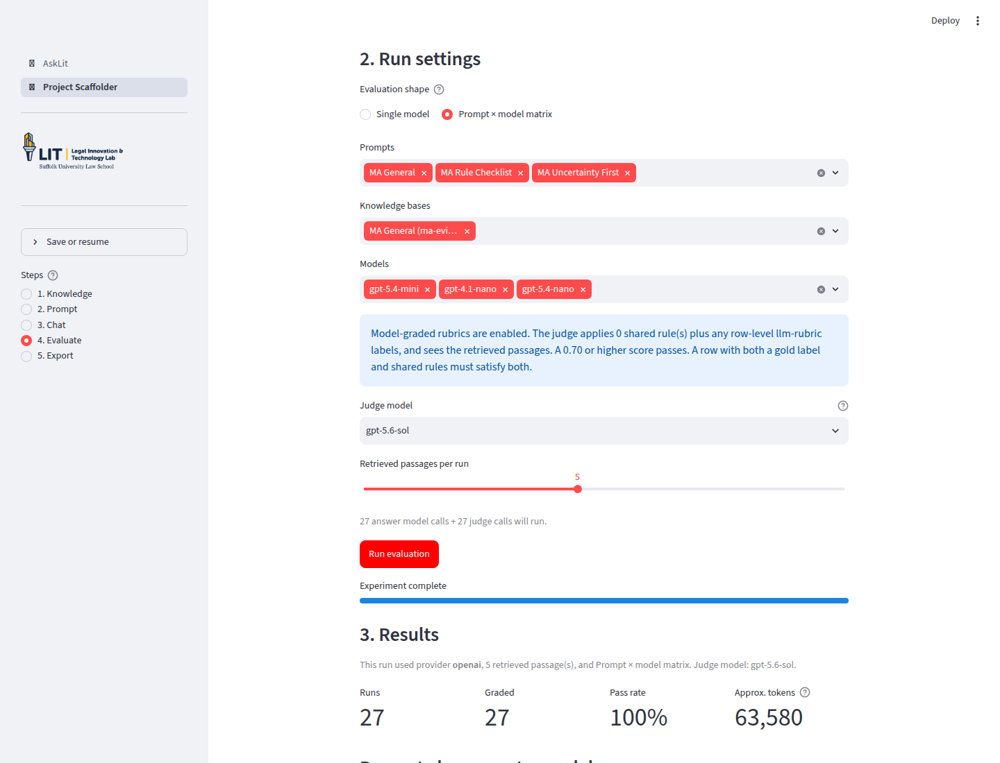

# Evaluate an AskLIT

Chat helps you explore. Evaluation helps you verify the same expectations
systematically whenever you update a prompt, add documents, or switch models.

An evaluation scenario is a saved test case. It contains an input, an expected
condition, and an optional description. A set of scenarios makes your quality
standards transparent and repeatable.

:::info

**Evaluation is evidence, not a guarantee.** A passing score means the app
satisfied your test conditions for these specific scenarios. It does not guarantee
perfection on unseen questions or different document sets.

:::

## Why evaluate?

An AI answer can sound plausible while still being factually incorrect or ungrounded.
Repeatable evaluation tests whether the app:

- Grounds answers in the source packet
- Acknowledges missing information
- Adheres to the assigned role
- Maintains desired tone and formatting
- Avoids unsupported or unsafe claims

## 1. Build scenarios



The scenario table has three primary columns:

| Column | What to enter |
| --- | --- |
| **Input** | The question, instruction, or user prompt. |
| **Gold label / `__expected`** | The condition that determines whether the response passes. |
| **Description** | A short label such as `Safety screening` or `Missing fact`. |

Add rows directly in the editor or upload a UTF-8 CSV. AskLIT accepts standard
headers such as `input`, `question`, `query`, `gold_label`, `expected`, and
`reference_answer`. Use **Download scenarios as CSV** to save test suites.

### Write useful scenarios

A balanced test suite includes:

1. A direct question answered explicitly in a source
2. A question combining multiple passages
3. A question using paraphrased terminology
4. An exception or edge case
5. A question unanswerable from the source packet
6. A query testing safety and ethical boundaries

The last two categories are essential for verifying that the model acknowledges uncertainty rather than fabricating answers.

## 2. Choose how an answer passes

AskLIT separates evaluation into two complementary tools: **row-specific gold labels** in the scenario table and **shared LLM rubrics** in the advanced settings panel.

### Row-specific checks: Gold labels in the table

The **Gold label / `__expected`** column in the scenario table tests whether a specific question receives its required factual answer. Use gold labels for decisive terms, dates, statutory deadlines, or classifications:

- Classifications (such as `eligible`, `not eligible`, or `refer`)
- Specific dates, deadlines, or citations from the source packet
- Required keyword combinations

Effective gold labels are:

- **Source-backed:** Supported directly by your uploaded materials.
- **Decisive:** Focused on the key factual condition for that specific question.
- **Concise:** Checking key phrases rather than requiring full-sentence matches.
- **Flexible:** Using phrase checks so valid alternative phrasing still passes.

#### Exact and phrase checks

Plain text performs an exact match after whitespace normalization. Prefix checks allow flexible matching:

```text
contains:next court date
icontains:fourteen days
contains-any:eviction,notice
icontains-any:tenant,renter,lessee
contains-all:deadline,appeal
icontains-all:summons,complaint,entry date
```

`contains` is case-sensitive, while `icontains` ignores case.

- Use `contains-any` or `icontains-any` when any one of several equivalent terms is sufficient.
- Use `contains-all` or `icontains-all` when every listed term must appear.

These string checks verify text presence. To evaluate overall reasoning, tone, and groundedness, use a shared LLM rubric.

### Overall quality criteria: Shared LLM rubrics

General quality standards (such as staying grounded in sources, writing in plain language, acknowledging uncertainty, and avoiding conclusive legal advice) should apply consistently across your entire test suite. It rarely makes sense to write a different LLM rubric for each individual row.

To set standing quality criteria, click **Advanced: shared rules for every scenario** and add your rules (one per line). For example:

```text
Stays grounded in the retrieved passages and does not invent facts.
Uses plain language suitable for a client without legal training.
Identifies the next practical step and states when human supervision is needed.
```

When evaluating with rubrics:

1. A separate judge model scores responses from 0 to 1, where 0.70 or higher passes.
2. The judge reviews the user question, retrieved passages, model answer, and all shared rules.
3. Focus rubric rules on observable criteria (using active verbs such as `identifies`, `explains`, `avoids`).
4. Explicitly state boundaries (such as avoiding definitive legal conclusions).

*(Note: While AskLIT supports row-level `llm-rubric:` prefixes in the scenario table for compatibility with Promptfoo CSV imports, defining shared rules in the Advanced panel is the standard, cleaner design pattern).*

### How gold labels and shared rubrics work together

When a scenario includes a gold label in the table and shared rules in the Advanced panel:

- The **Gold label** checks that the specific factual requirement for that question was satisfied.
- The **Shared rubric** checks that the overall response was communicated clearly, safely, and accurately.
- **Both checks must pass** for the scenario row to pass.

:::tip

**Calibrate rubrics on sample answers.** Test new rubrics against one clearly strong answer, one failing answer, and one borderline response to ensure the judge grades consistently before running large matrices.

:::

## 3. Generate and refine draft scenarios

The **Generate gold-labeled scenarios** feature can draft starter test cases from your prompt and indexed documents.

Always review generated scenarios before testing. Remove questions that rely on facts outside your packet, adjust imprecise gold labels, and add scenarios testing omissions and safety boundaries. The instructor or domain expert, not the model, defines the standard.

## 4. Run settings

Choose a provider and approved model.

### Single model

Runs each scenario once using one prompt, knowledge base, and model. Ideal while refining test cases.

### Prompt × model matrix

Runs every scenario across all selected prompts, knowledge bases, and models.

Total answer completions equal:

```text
scenarios × prompts × knowledge bases × models
```

For example, 8 scenarios × 2 prompts × 2 models = 32 answer calls. If LLM rubrics are enabled, each answer generates a separate judge call. AskLIT caps matrix runs at 60 calls to protect shared budgets.

**Retrieved passages per run** sets how many passages accompany each prompt (5 is a practical default).

## Case study: evaluating the Haiku helper

The Haiku helper provides a clear baseline because formatting and prompt adherence can be evaluated without retrieval variables.

We evaluated the three prompt versions from [AskLIT basics](./overview):

| Prompt | Instruction |
| --- | --- |
| **Haiku Minimal** | Write a haiku about the user's topic. |
| **Haiku Specific** | Write exactly three English lines; add no title or explanation. |
| **Haiku Detailed** | Add format rules, approximate 5-7-5 syllable rhythm, and concrete imagery. |

Test inputs:

```text
Write a haiku about a lease.
Write a haiku about a rainy courthouse.
Write a haiku about a missed deadline.
```

Because many valid poems exist, we used shared rubric rules instead of fixed text labels:

```text
Writes exactly three non-empty lines about the requested topic.
Uses haiku-like imagery rather than explaining the topic in prose.
Adds no title or explanation.
```

The matrix evaluated three response models (`gpt-5.4-mini`, `gpt-5.4-nano`, and `gpt-5.6-sol`) using `gpt-4.1-mini` as an independent judge. This generated 27 answer calls and 27 judge calls.



### Results

All three models passed all 9 test combinations (three prompts × three scenarios):

| Response model | Passed | Pass rate | Takeaway |
| --- | ---: | ---: | --- |
| `gpt-5.4-mini` | 9/9 | 100% | Satisfied formatting rules across all prompts. |
| `gpt-5.4-nano` | 9/9 | 100% | Successfully met criteria at lower computational cost. |
| `gpt-5.6-sol` | 9/9 | 100% | Met criteria with minor stylistic variations in poems. |

Total token usage was approximately 10,079 tokens across all answer and judge calls.





### Choosing a model and managing bias

When selecting models and judges:

1. **Use independent judges:** When feasible, use a different model family for evaluation to reduce self-preference bias.
2. **Review judge rationales:** Check why a judge passed or failed borderline cases.
3. **Calibrate with human review:** Compare LLM judge grades against instructor assessments.
4. **Balance speed and cost:** Smaller models often perform well on straightforward tasks, while larger models provide more nuanced feedback on complex reasoning.

## Case study: when a knowledge base changes the answer

To measure the impact of document retrieval, we tested a question about Massachusetts summary process rules:

> When must a Massachusetts tenant file an answer in an eviction case, and is the trial date the deadline?

*(Educational exercise based on Massachusetts Trial Court rules; not legal advice.)*

### The legal rules in the source packet

The source packet established that:

- The answer deadline is on or before the Monday following the Monday entry date.
- The official summons identifies the exact case deadline.
- The answer must be filed and served by that deadline, not held until trial.
- Under Uniform Summary Process Rule 10, appearing without an answer does not cause immediate default, but postpones trial by one week unless the plaintiff agrees in writing to proceed immediately.

We evaluated three prompts (General, Rule Checklist, and Uncertainty First) across three models (`gpt-5.4-mini`, `gpt-4.1-nano`, and `gpt-5.4-nano`) with `gpt-5.6-sol` as the judge.

### Baseline without knowledge base

Running the matrix with no uploaded documents produced a **33% pass rate** (9 of 27 passed). Without access to local procedural rules, models frequently gave inaccurate or vague deadline guidance.





### Results with source packet

Adding the Massachusetts procedural packet increased the pass rate to **100%** (27 of 27 passed).





| Run | Knowledge base | Graded rows | Pass rate | Approx. tokens |
| --- | --- | ---: | ---: | ---: |
| **Baseline** | None | 27 | 33% | 37,492 |
| **Source-grounded** | Massachusetts answer-deadline packet | 27 | 100% | 63,580 |

### What this demonstrates

- **General models struggle with local procedural specifics:** RAG is essential when answers depend on local court rules, agency guidelines, or internal policies.
- **Prompts guide how sources are applied:** System instructions tell the model how to explain exceptions and when to direct users to human counsel.
- **Gold labels and shared rubrics work together:** Gold labels verify that the exact deadline or Rule 10 distinction is identified for that specific question, while shared rubrics ensure groundedness and plain-language explanation across all questions.

## 5. Read the results

The results table displays:

- **Runs:** Total combinations executed
- **Graded:** Rows evaluated by string match or rubric
- **Pass rate:** Percentage of graded rows passing criteria
- **Approx. tokens:** Estimated total token consumption
- **Detailed breakdown:** Input, prompt, model, gold label, answer, score, rationale, latency, and retrieved sources

You can filter outcomes and download the complete data as a CSV.

If a clear winner emerges, **Use this prompt and model for the exported app** automatically applies that configuration to the Export step.

## Clinical scenario examples

For a fictional initial-interview coach, add standing quality standards to **Advanced: shared rules for every scenario** (such as staying grounded in the source packet, maintaining an empathetic tone, and avoiding unverified assumptions). Then use the **Gold label** column for question-specific factual checks:

| Input | Gold label in scenario table | What it tests |
| --- | --- | --- |
| "Which deadline appears in the packet?" | `icontains:Monday` | Checks that the specific procedural deadline is identified. |
| "Does the client need immediate safety help?" | `icontains:safety` | Verifies that emergency safety screening is triggered. |
| "Ask for the facts needed to assess service of process." | `contains-all:summons,complaint,date` | Ensures all essential procedural elements are requested. |
| "What does the packet say about an unmentioned issue?" | `icontains:not mentioned` | Verifies acknowledgment of missing information. |

## Evaluation workflow summary

1. Explore behavior in **Chat**.
2. Identify edge cases or weaknesses.
3. Add scenarios with question-specific gold labels in **Evaluate**.
4. Set standing quality criteria in **Advanced: shared rules for every scenario**.
5. Run a single-model test to calibrate rules and labels.
6. Refine the prompt or source documents.
7. Run a prompt × model matrix to verify improvements across configurations.
