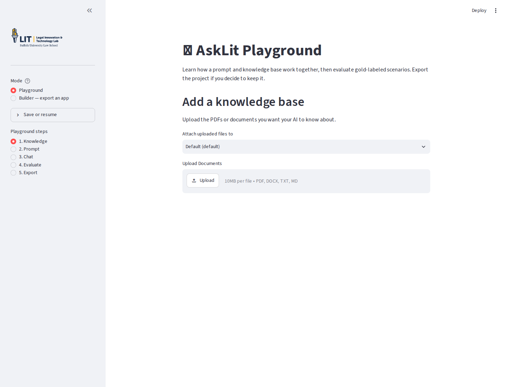
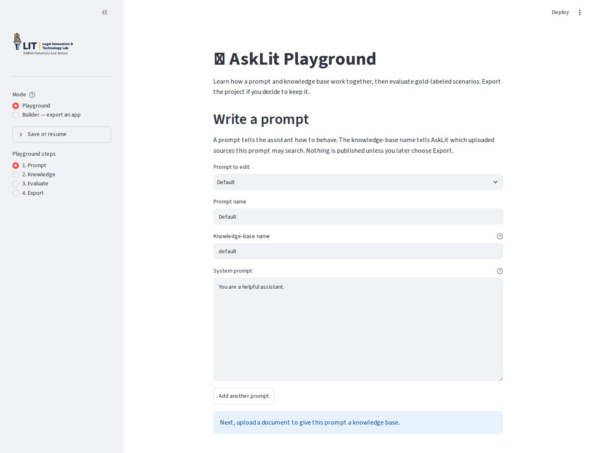
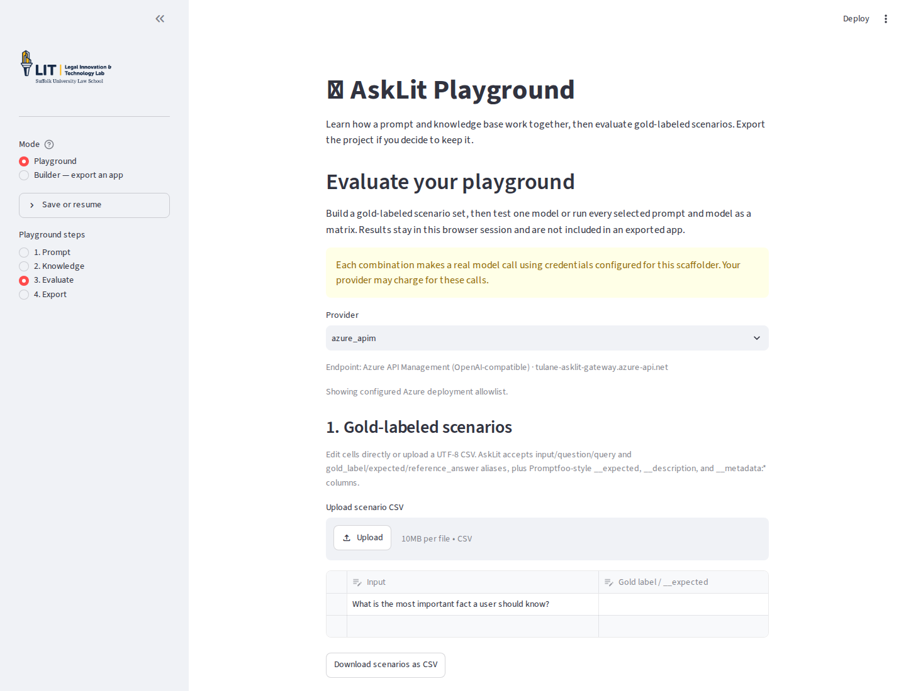
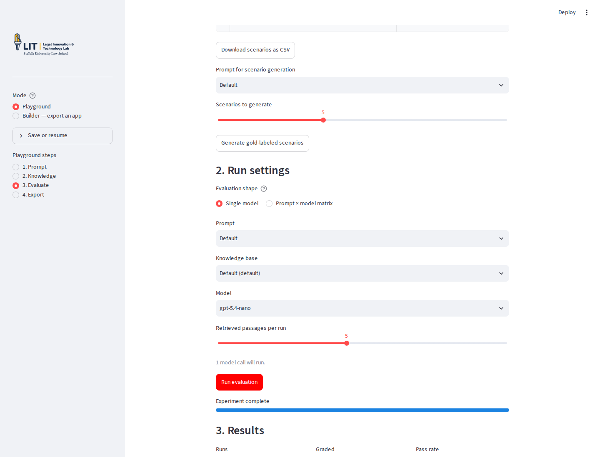

# Build an advisor with the AskLit Playground

The [AskLit Playground](https://suffolklitlab.org/asklit) is a gentle way to introduce a prompt + knowledge base application before students have to create a GitHub repository or deploy an app. In this tutorial, students build a small tenant-housing advisor, try it in a conversational preview, test it against realistic questions, and inspect the results.

The Playground keeps work in the current browser session. Students can download a YAML workspace at any point and resume it later. The final **Export** step turns a finished Playground project into a deployable app.

## 1. Add a knowledge base

Upload a small, focused source document—such as a housing-maintenance guide, clinic handout, or agency FAQ—and attach it to the matching knowledge base. AskLit indexes the document for retrieval when the advisor answers a question.



For a classroom exercise, use a document students can read in advance. Ask them to predict what the advisor should say before they run an evaluation.

## 2. Write the prompt

Start with a short role and behavior description. For example:

```text
You are a tenant-housing advisor. Answer using only the supplied housing guide.
Explain the next practical step in plain language. If the guide does not answer
the question, say so and suggest an appropriate local resource. Do not invent
deadlines, rights, or contact information.
```

Give the prompt a descriptive name, such as `Housing advisor`, and choose a knowledge-base name such as `housing`.



The prompt tells the model how to behave. It does not contain the source material; that belongs in the next step.

## 3. Try the advisor

Use the Chat step to ask a few questions before creating formal scenarios. This preview is useful for seeing whether retrieval is working and whether the prompt produces the tone and boundaries you intended. The conversation is session-only; the repeatable evaluation comes next.

## 4. Create and run evaluations

The evaluation area has three parts:

1. **Gold-labeled scenarios.** Edit the table directly or upload a UTF-8 CSV. The accepted columns include `input` (also `question` or `query`), `__expected`, and `__description`, which makes it easy to reuse Promptfoo-style datasets.
2. **Run settings.** Run every scenario against one model, or select multiple prompts and models in matrix mode. The caption shows how many model calls will be made before students start.
3. **Results.** Review the answer, expected label, pass/fail status, retrieved sources, latency, and approximate token count. Use the filters to focus on one prompt, model, or outcome, then download the complete results table as CSV.



### Choosing useful gold labels

Plain text expected values use exact matching. For natural-language answers, prefer an assertion such as:

```text
icontains:notify the landlord
```

Other supported forms include `contains:`, `contains-any:`, `icontains-any:`, `contains-all:`, and `icontains-all:`. Keep the decisive phrase short enough to allow harmless synonyms, but specific enough to catch an answer that misses the point. For example, `icontains:written notice` may be more useful than requiring an entire sentence.

An evaluation failure is not automatically a model failure. Ask students to compare the answer with the gold label: a response that says “contact the landlord/property manager” may be substantively correct while still failing the narrower label `icontains:notify the landlord`. Revising the scenario or assertion is part of evaluation design.



The warning above the evaluation controls is intentional: each matrix combination makes a real model call and may incur provider charges. Start with one or two scenarios, then expand the matrix after checking the labels.

## 5. Save, resume, or export

Open **Save or resume** in the sidebar to download a workspace YAML file. It contains the prompt settings, knowledge-base pairings, and evaluation scenarios, but not API keys, uploaded document contents, vector indexes, or generated answers. Import the YAML later to continue working, then re-upload any source documents it lists.

When the advisor is ready to keep, choose **5. Export**. Students can export the project for GitHub and deployment; they do not need to make that decision before learning the prompt-and-knowledge-base loop.

## Suggested classroom sequence

1. Give each group the same one-page housing guide.
2. Have groups write different advisor prompts and predict two good answers.
3. Ask groups to create three scenarios: a straightforward question, a question requiring a specific next step, and a question outside the guide.
4. Run the scenarios, inspect retrieved sources, and revise any labels that are too brittle.
5. Compare two prompts in matrix mode and discuss whether the pass rate reflects helpfulness.
6. Save the workspace YAML so groups can return to it, then export only the projects they want to deploy.
