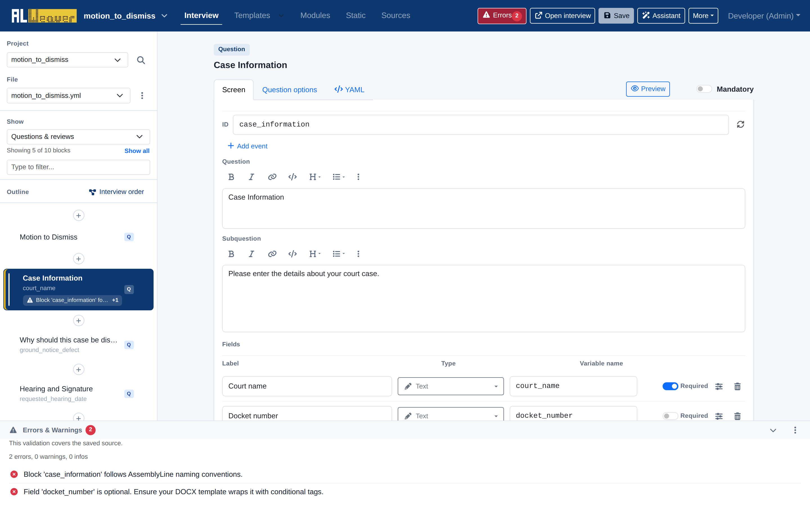
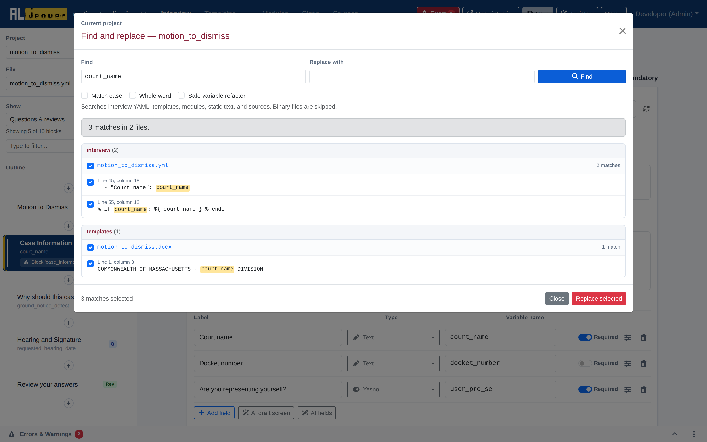
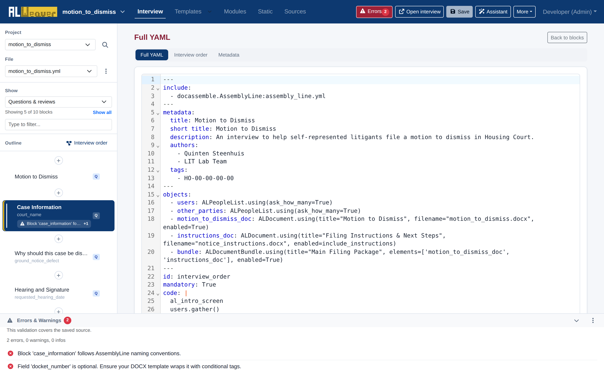

import Tabs from '@theme/Tabs';
import TabItem from '@theme/TabItem';

The Weaver includes comprehensive static analysis tools, project-wide safe variable refactoring, and an embedded CodeMirror 6 YAML editor to ensure your interview code remains clean, error-free, and maintainable.

---

## Real-time validation and diagnostics

The bottom **Errors & Warnings** drawer continuously analyzes your interview as you make changes:

The linter automatically checks for:
* **Duplicate or Missing Block IDs**: Flags blocks that share an ID or omit an essential `id:` tag.
* **Undefined Variables**: Detects references in questions, review screens, or order logic that have no matching field definitions or object declarations.
* **Template Field Mismatches**: Warns if a variable is used in a DOCX or PDF template but is missing from your question screens.

For plain-language and style review, use the validation drawer's **Style check** action separately — it is not part of the always-on drawer checks and calls an AI-assisted review of your question wording.

---

## Project-wide find and replace with safe variable refactoring

Renaming a variable across a complex project with a simple text search-and-replace often causes unintended side effects—corrupting user-facing labels, subquestions, or comments.

Click the magnifying-glass icon next to the project selector in the left rail to open **Find and replace**:

### Safe variable refactoring mode
* **AST & Structure Awareness**: Uses Python Abstract Syntax Tree (AST) parsing and YAML stream analysis to distinguish between actual variable references and identical words in human-facing text.
* **Multi-File Scope**: Finds and updates occurrences across YAML interviews, DOCX Jinja2 templates, and Python modules simultaneously.
* **Selective Replacement**: Displays a list of matches with surrounding context and checkboxes, allowing you to choose exactly which occurrences to replace.

---

## Full raw YAML view

For power users who prefer to inspect or edit raw code directly, click **More** $\to$ **YAML source**:

The built-in CodeMirror 6 editor provides:
* Full syntax highlighting for Docassemble YAML, Mako templates, and embedded Python expressions.
* Code folding, line numbering, and bracket matching.
* **Two-Way Synchronization**: Any valid edits made in the raw YAML view are parsed and updated in the visual block outline as soon as you return to the block editor.

---

## Next steps

* Push your interview to GitHub in [Publishing and version control with GitHub](publishing_and_github.md).
* Review the [Authoring checklist](authoring_checklist.md) before publishing.
