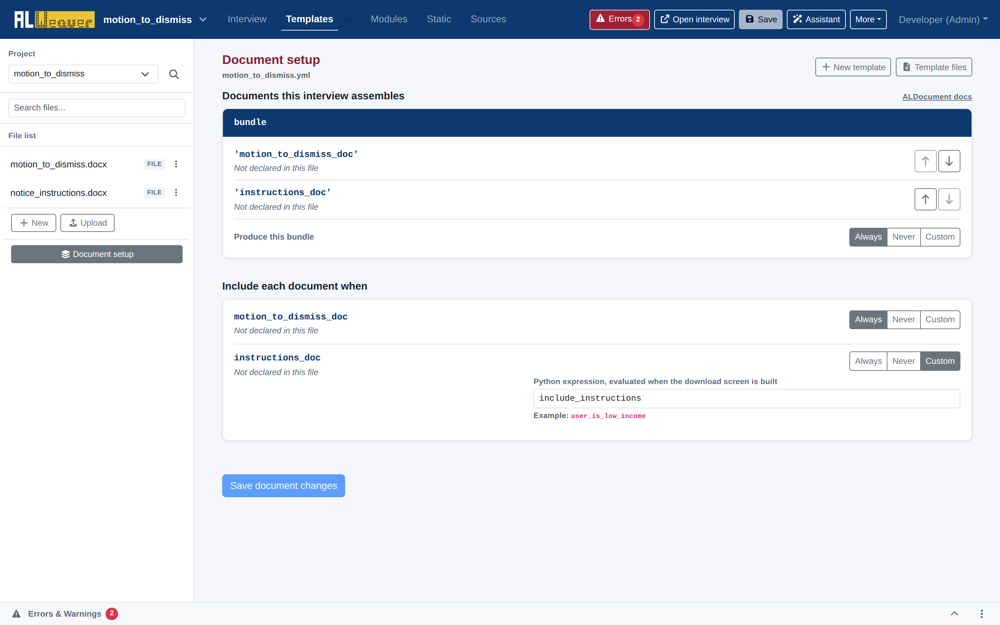

import Tabs from '@theme/Tabs';
import TabItem from '@theme/TabItem';

In the **Templates** view of the Weaver, clicking **Document setup** opens the document assembly manager. This interface controls which templates are compiled, how multiple documents are bundled together, and the conditional rules that govern when specific documents are generated.



---

## Working with template files

You can upload both DOCX and PDF templates into your project:

1. Click **Upload** in the left sidebar of the Templates tab to add a new labeled DOCX or PDF file.
2. The Weaver analyzes the template's Jinja2 tags or PDF form fields and registers them in the project.

---

## Understanding document bundles (`ALDocumentBundle`)

An `ALDocumentBundle` combines one or more `ALDocument` items into a unified downloadable packet (such as a single PDF containing a Motion, an Affidavit of Indigency, and a Certificate of Service):

```yaml
objects:
  - motion_to_dismiss_doc: ALDocument.using(title="Motion to Dismiss", filename="motion_to_dismiss.docx", enabled=True)
  - instructions_doc: ALDocument.using(title="Filing Instructions", filename="instructions.docx", enabled=include_instructions)
  - bundle: ALDocumentBundle.using(title="Main Filing Package", elements=['motion_to_dismiss_doc', 'instructions_doc'], enabled=True)
```

---

## Document inclusion rules

For each document in your bundle, you can configure when it should be compiled:

* **Always**: The document is always generated and included in the final download package.
* **Never**: The document is excluded by default (useful for draft or reference templates).
* **Custom (Condition)**: Enter a Python condition (e.g. `include_instructions` or `user_has_fee_waiver`). The document will only be assembled when this expression evaluates to `True`.

---

## Reordering documents in the bundle

Use the up (<i class="fa-solid fa-arrow-up"></i>) and down (<i class="fa-solid fa-arrow-down"></i>) buttons next to each document entry to change the order in which documents are assembled and merged into the final packet.

---

## Next steps

* Add a summary review screen for user verification in [Review screen synchronization](review_screens.md).
* Check your interview for errors in [Diagnostics, refactoring, and YAML code view](diagnostics_and_refactoring.md).
