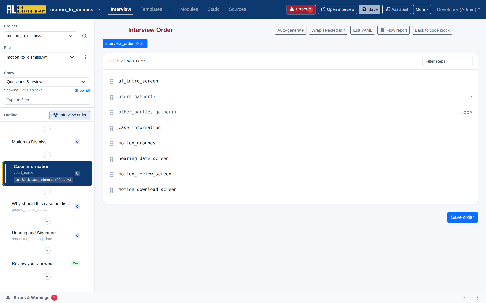
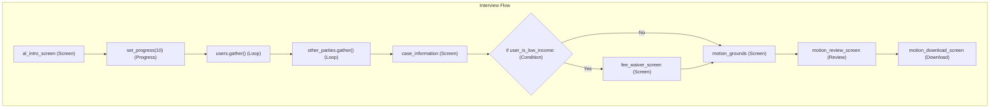

import Tabs from '@theme/Tabs';
import TabItem from '@theme/TabItem';

Docassemble is a goal-directed system that seeks out variables as needed. However, every production AssemblyLine interview relies on a central **Interview Order** block (`mandatory: True`) to ensure that users encounter screens, introductory text, list-gathering loops, and review screens in a logical, guided sequence.

Click the **Interview order** button in the left navigation rail to open the visual flow builder:



---

## The interview order block

Behind the scenes, the Order Builder manages a `mandatory: True` code block (by default with `id: interview_order`):

```yaml
---
id: interview_order
mandatory: True
code: |
  al_intro_screen
  set_progress(10)
  users.gather()
  other_parties.gather()
  set_progress(40)
  case_information
  if user_is_low_income:
    fee_waiver_screen
  motion_grounds
  set_progress(80)
  hearing_date_screen
  motion_review_screen
  motion_download_screen
```

---

## Types of flow steps



The Order Builder represents each flow element visually with distinct badges and formatting:

1. **Screen Steps**: Individual question screens (e.g., `al_intro_screen`, `case_information`).
2. **List Gather Steps (`LOOP`)**: Calls `.gather()` on an `ALPeopleList` or list object to trigger iterative questions for all members of the list.
3. **Conditional Branches (`IF/ELSE`)**: Branches that display specific screens only when a condition evaluates to `True`.
4. **Progress Indicators (`PROGRESS`)**: Updates the on-screen progress bar percentage (e.g., `set_progress(50)`).
5. **Section Dividers (`SECTION`)**: Marks the active navigation section in the progress outline (e.g., `nav.set_section('case')`).
6. **Code Steps**: Custom Python expressions or calculations executed silently between screens.

---

## Visual reordering and branching controls

* **Drag-and-Drop Reordering**: Grab the drag handle (<i class="fa-solid fa-grip-vertical"></i>) beside any step to move it up or down in the sequence.
* **Wrap selected in if**: Check the selection box next to one or more steps and click this button to nest them inside a conditional branch.
* **Auto-generate**: Infers a draft interview sequence based on your declared question blocks, people lists, and document bundles.
* **Edit YAML**: Switch to inline code view to make manual Python adjustments to the order block.

---

## Next steps

* Configure template output and bundles in [Document bundles and templates](document_bundles.md).
* Add a summary review block in [Review screens](review_screens.md).
