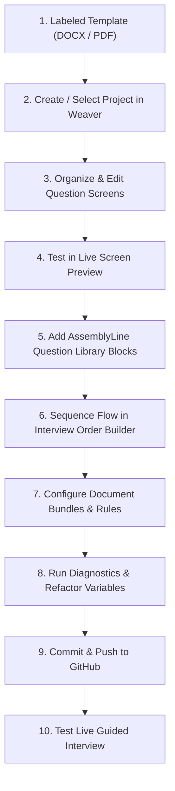
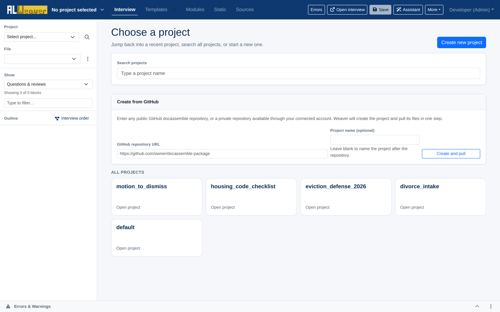
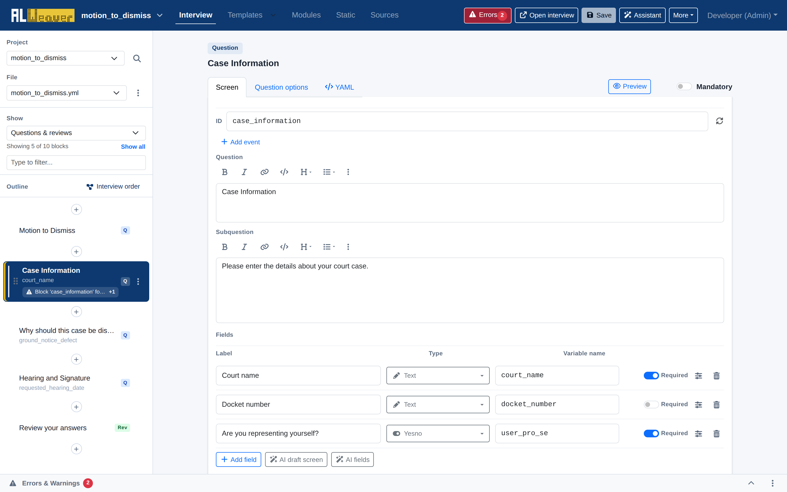

import Tabs from '@theme/Tabs';
import TabItem from '@theme/TabItem';
import { Button } from '/docs/react_components/Button.jsx';

The **Assembly Line Weaver** is the official visual authoring environment for Docassemble and the Document Assembly Line. It provides a visual **WYSIWYM** (What You See Is What You Mean) workspace that lets you build, preview, sequence, and refine guided legal interviews—from a freshly labeled DOCX or PDF template all the way to a production-ready application.

  <Button
    href="https://apps-dev.suffolklitlab.org/al/editor"
    target="_blank"
    rel="noopener noreferrer"
    style={{ "--ifm-button-size-multiplier": "1.25" }}
  >
    Launch the Weaver
  </Button>
  <Button
    href="https://apps-dev.suffolklitlab.org/start/ALWeaver/assembly_line?new_session=1"
    className="button button--secondary"
    target="_blank"
    rel="noopener noreferrer"
    style={{ "--ifm-button-size-multiplier": "1.25" }}
  >
    Launch the legacy wizard
  </Button>

:::info Legacy Weaver wizard
The linear wizard-style Weaver is still available, but is no longer actively maintained. We recommend using the visual Weaver for all new interviews and ongoing maintenance.
:::

:::tip Playground and Weaver synchronization
The Weaver operates directly on your Docassemble **Playground** projects. Any changes you save in the Weaver are immediately stored in your Playground files and can be run, debugged, or committed to version control.
:::

---

## Why use the Weaver?

Traditional Docassemble interview creation previously required either writing hundreds of lines of YAML and Python by hand or running a one-time linear wizard. The Weaver combines the speed of automated template scaffolding with the control of a full IDE:

* **Continuous, non-linear editing**: Modify screen questions, reorder steps, add conditional branching, and adjust template mappings at any point without restarting a wizard.
* **Instant screen previews**: See how each question screen looks in real time using Docassemble's native stylesheets across desktop, tablet, and mobile viewports.
* **Visual interview order builder**: Structure your interview flow, loops, progress bars, and conditional branches with an intuitive drag-and-drop hierarchy.
* **Standard AssemblyLine library integration**: Pull pre-built, plain-language question components for names, addresses, language interpreters, and demographics directly into your interview.
* **Document bundle assembly**: Visually organize multiple DOCX and PDF templates into download packages with conditional inclusion rules.
* **Safe project-wide refactoring**: Rename variables across YAML interviews, DOCX templates, and Python modules with semantic AST awareness that preserves ordinary text and prose.
* **Built-in quality diagnostics**: Catch missing IDs, duplicate blocks, undefined variables, and style warnings before running your interview.
* **Integrated GitHub publishing**: Commit and push changes to GitHub repositories right from the browser.

Watch a demonstration of the Weaver:

<iframe width="560" height="315" src="https://www.youtube.com/embed/3arBAl3jtqM?si=zNQ7gC5kDZQJeoUp" title="YouTube video player" frameborder="0" allow="accelerometer; autoplay; clipboard-write; encrypted-media; gyroscope; picture-in-picture; web-share" referrerpolicy="strict-origin-when-cross-origin" allowfullscreen></iframe>

---

## Start-to-finish workflow overview

Building an interview with the Weaver follows a streamlined path from initial document preparation to deployment:

---

## Workspace layout and navigation

When you open the Weaver, you can select an existing Playground project, start a new project, or clone a repository from GitHub.

Once inside a project, the interface is organized into intuitive work areas designed for rapid authoring:

1. **Top navigation bar**:
   * **View tabs**:
     * **Interview**: Visual block editor and outline for interview screens and code blocks.
     * **Templates**: Document template manager and `ALDocumentBundle` setup.
     * **Modules**: Python modules and custom business logic.
     * **Static**: Static assets (images, stylesheets, custom JS).
     * **Sources**: CSV data tables and lookup files.
   * **Errors badge**: A live count of validation issues next to the **Errors** button; click it to open the Errors & Warnings drawer.
   * **Open interview**: Launches the current interview in a new tab for live runtime testing.
   * **Save**: Writes all changes to the server (`Ctrl+S` or `Cmd+S`).
   * **Assistant**: Toggles the AI editing assistant panel, when it is enabled on your server.
   * **More menu**: Access **YAML source**, **AssemblyLine settings**, **Open in Playground**, **Commit to GitHub**, **Pull changes from GitHub** (once a repo is linked), and **Switch project**.
2. **Left navigation rail**:
   * **Project and file selectors**: Switch between Playground projects and between YAML interview files in the project.
   * **Find or replace across project**: The magnifying-glass icon next to the project selector opens project-wide find and replace.
   * **Show filter**: Filter the outline by block type — question/review screens, code, objects, events, sections, metadata, modules, templates, tables, all blocks, or disabled blocks.
   * **Search filter**: Type to filter blocks in the outline by title or variable name.
   * **Interview order button**: Opens the visual flow sequencer.
   * **Block outline**: Drag-and-drop tree of all blocks in the active file with quick-add (`+`) buttons between blocks.
3. **Central canvas**:
   * The active block editor with tabs for **Screen**, **Question options**, and **YAML**, plus a separate **Preview** button.
4. **Bottom drawer**:
   * Collapsible **Errors & Warnings** panel displaying static analysis findings.

---

## Explore the Weaver documentation

Follow the guides below to master each stage of building a guided interview:

1. [**Question screens and fields**](screens_and_fields.md) — Author interactive question screens, field types, labels, help text, and show-if visibility logic.
2. [**Live screen previews**](screen_previews.md) — Test screen UX in real time across desktop, tablet, and mobile viewports.
3. [**Question library and people**](question_library.md) — Manage `ALPeopleList` objects and insert standardized questions for names, addresses, and accommodations.
4. [**Interview order builder**](interview_order.md) — Visually structure the interview flow, loops, conditional branches, progress bars, and sections.
5. [**Document bundles and templates**](document_bundles.md) — Configure `ALDocument` and `ALDocumentBundle` download packets with conditional inclusion rules.
6. [**Review screens**](review_screens.md) — Synchronize summary review screens with interview questions.
7. [**Diagnostics and refactoring**](diagnostics_and_refactoring.md) — Run static quality checks, refactor variables safely across YAML and DOCX, and edit raw YAML.
8. [**GitHub and publishing**](publishing_and_github.md) — Publish packages, manage branches, and commit to GitHub directly from the Weaver.
9. [**Authoring checklist**](authoring_checklist.md) — Review the start-to-finish quality checklist before deploying your interview.
