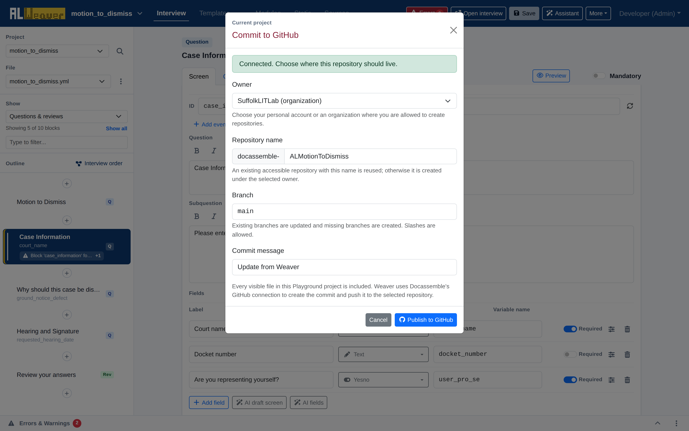

import Tabs from '@theme/Tabs';
import TabItem from '@theme/TabItem';

When your interview is ready for user testing, peer review, or production deployment, you can commit and push it directly to GitHub without leaving the Weaver.

Click **More** $\to$ **Commit to GitHub** to open the publishing modal:

---

## Publishing workflow

1. **Owner**: Choose your personal GitHub account or an organization account (such as `SuffolkLITLab`) among the ones your Docassemble server's GitHub integration can access.
2. **Repository name**: The `docassemble-` prefix is fixed; type the rest of the name (e.g. `ALMotionToDismiss`). An existing accessible repository with that name is reused, otherwise a new one is created under the selected owner.
3. **Branch**: Defaults to `main`. Type an existing branch name to update it, or a new one to create it.
4. **Commit message**: Defaults to "Update from Weaver" — replace it with a concise, descriptive summary of the changes.
5. **Publish to GitHub**: Every visible file in the project is included. The Weaver creates the commit, pushes it, and shows links to the repository and the commit.

---

## Pulling updates from GitHub

If collaborating with a team, you can pull remote updates directly into your Playground project:

1. Click **More** $\to$ **Pull changes from GitHub** (this item only appears once the project is linked to a repository).
2. The Weaver fetches the latest commits from your upstream repository branch and refreshes your visual project files.

---

## Next steps

* Run through the [Authoring checklist](authoring_checklist.md) to confirm all quality checks before launching.
