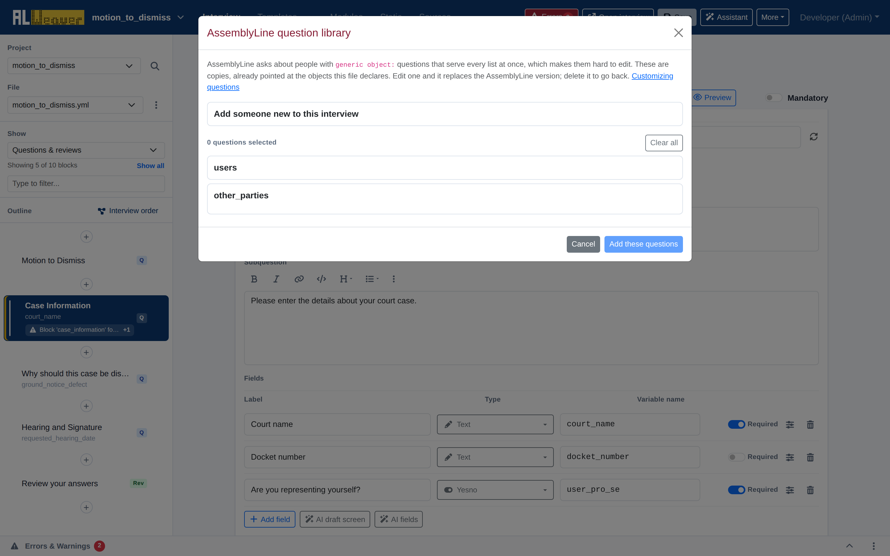

import Tabs from '@theme/Tabs';
import TabItem from '@theme/TabItem';

The AssemblyLine framework uses standardized object structures (`ALPeopleList` and `ALIndividual`) to represent individuals and parties, such as `users`, `other_parties`, `children`, and `attorneys`.

The Weaver includes a built-in **Question library** browser that lets you declare people lists and insert pre-built, accessibility-vetted questions directly into your interview.



---

## Managing people objects

When you add someone new from the question library, the Weaver declares the list (or single person) in the `objects:` block and asks you to pick one of four quantity rules, which it writes as keyword arguments to `ALPeopleList.using(...)`:

```yaml
objects:
  - users: ALPeopleList.using(there_are_any=True)
  - other_parties: ALPeopleList.using()
  - children: ALPeopleList.using(ask_number=True)
```

### Quantity rules
* **Ask whether there are any** (`there_are_any=True`) — the default. Asks a preliminary yes/no question (e.g. "Do you have any children?") before gathering details.
* **At least one** — no extra keyword argument. Skips the "are there any?" question and starts by gathering one.
* **Ask how many** (`ask_number=True`) — asks the user for a number first, then gathers that many.
* **Exactly this many** (`target_number=<N>`) — never asks; use this when a form has room for a fixed number of people, such as `target_number=1` for a single party.

---

## Pre-built AssemblyLine questions

Click a `+` quick-add button in the block outline, then choose **AssemblyLine question library** from the add-a-block menu. For each person object declared in the file, it offers:

* **Gather questions**: the screens that ask whether there are any, how many, and each person's name (these depend on the quantity rule you picked — see above).
* **Attribute questions**, one block each: Address, Mailing address, Birthdate, Gender, Pronouns, Language, Phone number, Mobile number, and Email address.

Each entry inserts an editable copy of AssemblyLine's own question wording, already pointed at your object (e.g. `children[i].address`). Editing the copy overrides AssemblyLine's version; deleting it reverts to AssemblyLine's original. Note that name fields for an existing gather loop come from the `name_fields` field type described in [Question screens and fields](screens_and_fields.md), not from this library.

---

## Why use standard question blocks?

Using standard AssemblyLine question blocks ensures:

1. **Court Consistency**: Variable names and data structures match what court e-filing systems and standard court forms expect.
2. **Plain Language**: Prompts have been refined and user-tested for accessibility.
3. **Translations**: AssemblyLine's standard question wording has community-contributed translations into multiple languages, which a copied-in block inherits.

---

## Next steps

* Sequence loops like `users.gather()` in the [Interview order builder](interview_order.md).
* Configure your output documents and templates in [Document bundles](document_bundles.md).
