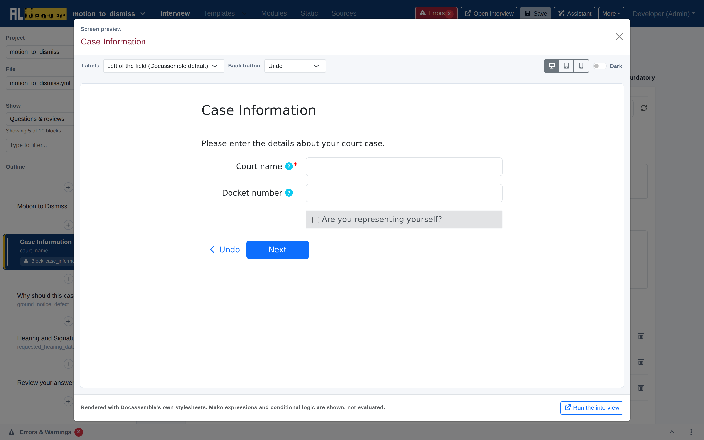

import Tabs from '@theme/Tabs';
import TabItem from '@theme/TabItem';

To verify how your question screens will look and behave for end users, click the **Preview** button (<i class="fa-solid fa-eye"></i>) in the upper right corner of the block editor.

---

## Real-time rendering with Docassemble stylesheets

The Weaver renders screen previews using Docassemble's native stylesheets and JavaScript widgets, giving you a high-fidelity view of the actual layout, typography, buttons, and form inputs as they will appear when published. Mako expressions and conditional logic are shown as written, not evaluated — for behavior that depends on prior answers, use **Run the interview** instead.

---

## Responsive viewports

Users will access your interview from a wide variety of devices. The preview modal includes one-click viewport simulation:

* **Desktop Viewport** (<i class="fa-solid fa-desktop"></i>): Standard widescreen layout for laptops and desktop monitors.
* **Tablet Viewport** (<i class="fa-solid fa-tablet-screen-button"></i>): Medium layout matching iPad and tablet screen dimensions.
* **Phone Viewport** (<i class="fa-solid fa-mobile-screen-button"></i>): Compact mobile layout to test touch targets, vertical spacing, and responsive wrapping.

---

## Visual styling and navigation toggles

* **Labels**: Choose *Left of the field* (Docassemble's default), *Above the field*, or *Floating* to see how field prompts align.
* **Back button**: Preview the screen with the back button labeled *Undo* (AssemblyLine's default) or *Back*.
* **Dark**: Toggle a dark-mode simulation to verify contrast, icon visibility, and readable color palettes.

---

## Running the live interview

While the preview modal is great for rapidly testing individual screen layouts, you can launch the entire interactive interview at any time:

1. Click **Run the interview** from within the preview modal, or click **Open interview** from the top navigation bar.
2. Docassemble will launch the interview in a new browser tab, allowing you to walk through the interview end-to-end, test dynamic logic, and generate completed documents.

---

## Next steps

* Insert standardized people questions using the [Question library](question_library.md).
* Organize your interview screens and loops in the [Interview order builder](interview_order.md).
