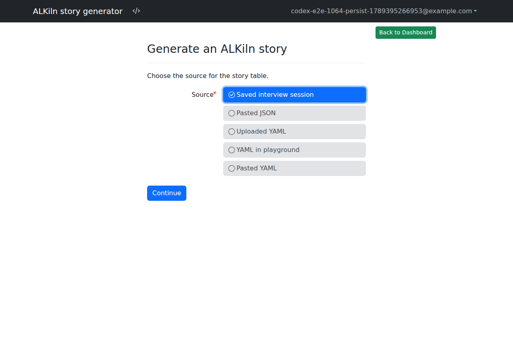
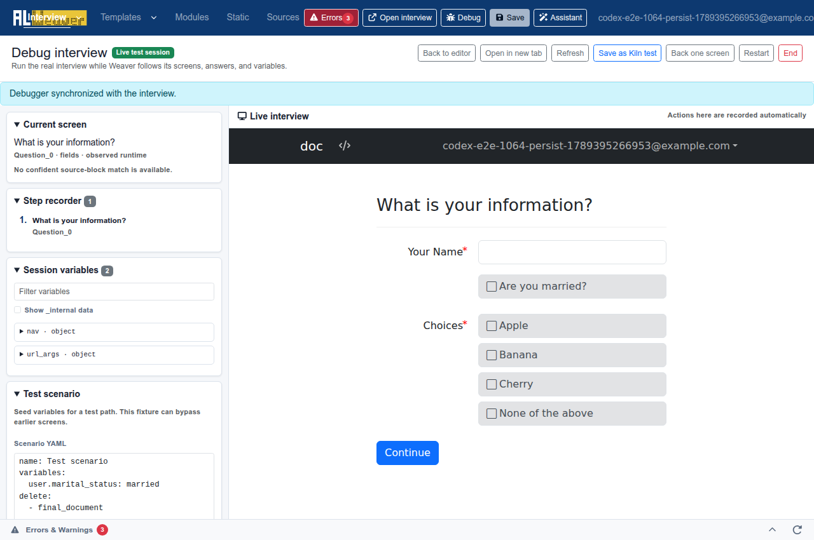
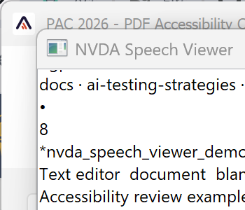
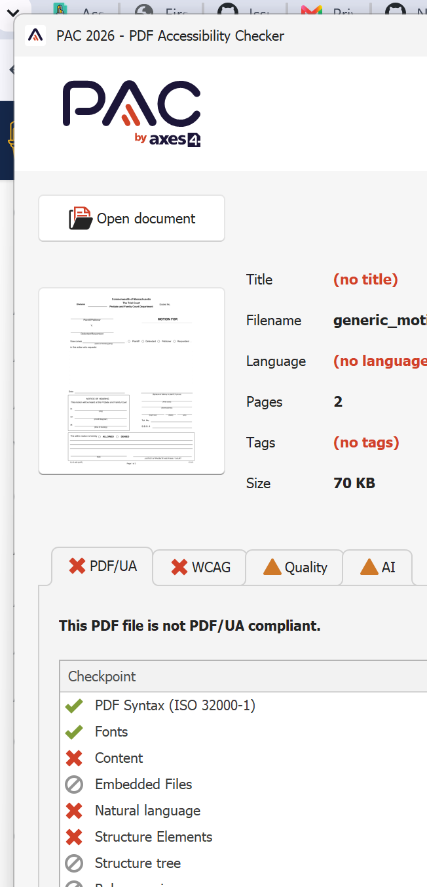
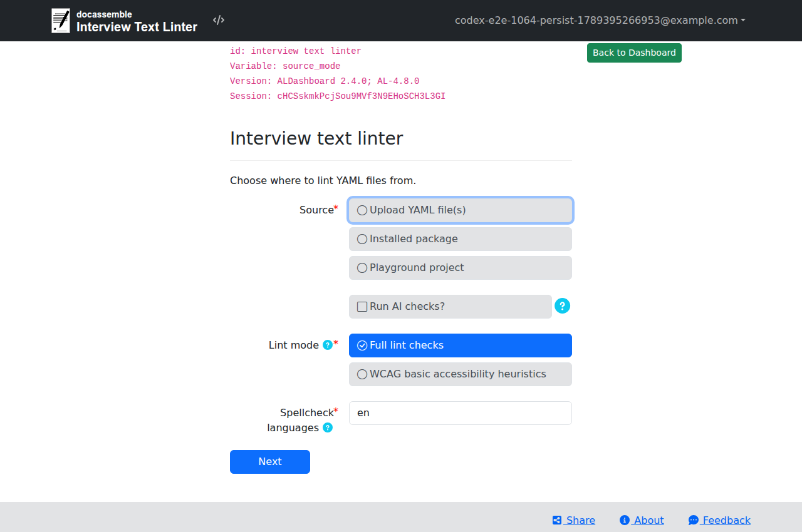

# Test Docassemble interviews with AI coding agents

AI can help draft tests, run the existing toolchain, and investigate failures. It
does not replace assertions or human review. The useful division of labor is:

- use `dayamlchecker` and the ALDashboard linter for fast static checks;
- use ALKiln for browser behavior, JavaScript, and automated accessibility checks;
- use the Docassemble API for fast checks of interview state and branching; and
- manually review legal accuracy, usability, assistive-technology behavior, and
  generated documents.

## Choose a tool

| Tool type | Examples | Best use | Main limitation |
| --- | --- | --- | --- |
| Web chat without connected tools | ChatGPT, Claude, Gemini | Review a pasted error, question block, test report, or small set of uploaded files | It can only use the context you provide. You must apply and verify suggestions. |
| Connected cloud agent | ChatGPT Work with the GitHub plugin and browser | Read an authorized repository, create or update pull requests, call available API tools, run an interview in a browser, and capture screenshots | Its cloud browser cannot reach a server that exists only on your computer. Testing needs a remotely reachable server and may be slower or disrupt that server. |
| Desktop coding agent | Codex in the ChatGPT desktop app, Claude Code in Claude Desktop | Open a local folder, review diffs, run several tasks, and inspect files in a graphical interface | It can change files and run commands. Check its selected folder and permissions before starting. |
| Terminal coding agent | Codex CLI, Claude Code, Gemini CLI or Antigravity CLI | Search the whole repository, edit tests, run checks, and repeat until failures are resolved | It uses the tools and credentials available in that shell. Approve commands carefully. |

Use a plain web chat for advice or a small review. A connected ChatGPT session
can use the [GitHub plugin](https://learn.chatgpt.com/docs/plugins) to inspect
repository content and work with pull requests. In Work mode, it can also use a
[cloud browser](https://learn.chatgpt.com/docs/browser) to operate an interview
and take screenshots. Use a local coding agent when you need direct access to
uncommitted files, local tools, or a local Docassemble server.

## Set up a local coding agent

All terminal agents need an internet connection and access to the project
folder. Install Git and the project's own test dependencies before asking an
agent to run tests. Keep secrets out of prompts, fixtures, screenshots, and Git.

The agent itself may have additional requirements:

- [Codex CLI](https://learn.chatgpt.com/docs/codex/cli) has standalone installers
  for macOS, Linux, and Windows. The optional npm installation requires Node.js.
- [Claude Code](https://code.claude.com/docs/en/overview) has native installers.
  Its native installation usually includes `ripgrep`; Git for Windows is
  recommended if you want it to use Bash on Windows. The Claude desktop app includes Claude
  Code, so it does not require a separate CLI installation.
- [Gemini CLI](https://geminicli.com/docs/get-started/installation/) requires
  Node.js 20 or newer when installed with npm. Its documentation also describes
  Homebrew and container-based installation. Google currently directs some
  account tiers to Antigravity CLI, so follow the sign-in guidance shown for
  your account rather than assuming the two products have identical access.

:::caution Review installation commands
Commands such as `curl ... | sh`, global npm installs, and package-manager
commands change your computer. Use the vendor's current installation page,
follow your organization's security policy, and ask the agent to explain any
additional dependency before approving it.
:::

Project dependencies are separate from the agent. For example, an agent may
need Python and a virtual environment to run `dayamlchecker`, or Node.js and a
browser installed by Playwright to run browser tests. Install only what the
repository's setup instructions require; an AI agent should not guess at a
large system-package list.

Start the desktop agent with the package folder open, or start a terminal agent
from the package root:

```bash
cd /path/to/your/docassemble-package
git status
```

Before allowing edits, make a commit or otherwise preserve a known-good state.
Give the agent write access only to the project and use approval prompts for
commands outside it, network access, and package installation.

## Run repeated tests on a local Docassemble server

A local Docassemble server usually makes AI-assisted testing faster. Uploads,
package reinstalls, API calls, and browser runs stay on your computer instead of
waiting on a remote connection. It also keeps a broken package, runaway loop, or
large batch of agent-generated tests from slowing down or crashing a shared
development server.

This is an important tradeoff when choosing a tool. ChatGPT Work's cloud browser
runs on a separate computer, so it needs a remotely reachable Docassemble test
server. A desktop or terminal agent running on your computer can instead test
`http://localhost`. Use the cloud workflow when GitHub and pull-request access
matter more; use the local workflow for faster, safer iteration.

Run Docassemble in Docker for this workflow. Follow the existing
[local Docker and VS Code setup guide](../admin_guide_docassemble/run-docassemble-docker-vscode.md)
for installation, startup, a local API key, and package installation. For other
operating systems or Docker configurations, use the
[official Docassemble Docker instructions](https://docassemble.org/docs/installation.html#docker).
Docker is the main additional dependency; Windows users may also need WSL 2,
depending on their Docker setup.

After the server is running:

1. Install the package and its dependencies on the local server.
2. Give the agent the local base URL, such as `http://localhost`, and a test-only
   account or API key.
3. Ask it to run one known interview path before attempting a larger test suite.
4. Run API and browser tests against the local URL. Save screenshots and test
   reports as artifacts.
5. Use a shared test server for a final check when you need to verify its exact
   configuration, authentication, email or SMS delivery, or other external
   integrations.

Keep using synthetic data. A local server can still reach mounted files, your
network, and any credentials you configure in it. Do not copy production secrets
or client data into the container, and do not point an automated test suite at a
production server.

## Give the agent a verifiable task

State the outcome, relevant files, allowed actions, and proof you expect. For
example:

```text
Review this Docassemble package and add ALKiln coverage for the fee-waiver
eligibility branches.

1. Read the existing ALKiln tests and repository instructions first.
2. Run the existing static checks and tests before editing.
3. Reuse valid ALKiln steps; do not invent step phrases or variable names.
4. Add the smallest scenarios that cover each boundary and early exit.
5. Run the affected tests. Inspect the diff and report any check you could not run.
6. While testing the interview, capture screenshots of each important result at
   desktop and mobile widths. Inspect the screenshots and flag layout, validation,
   or content problems; do not treat a screenshot as proof that the logic is correct.
```

For screenshot requests, the agent needs a browser tool such as Playwright or a
supported browser integration. Tell it which test server and synthetic persona
to use. Do not give an agent production credentials or real client data. Ask it
to save screenshots as test artifacts with descriptive names so that a human
can compare what it saw with its written conclusion.

## Draft ALKiln scenarios from a recorded path

[ALKiln](../components/ALKiln/intro.mdx) drives a real browser through an
interview. A reliable AI-assisted workflow is:

1. Complete one representative path in a test interview.
2. Generate a Story Table draft with ALDashboard's **Generate an ALKiln story**
   tool or the Weaver debugger's **Save as Kiln test** action.
3. Run the generated scenario unchanged and fix it before adding variants.
4. Give the working scenario and the relevant branching rules to the agent.
5. Ask for one change at a time: a boundary value, an early exit, a repeated
   item, or an output assertion.
6. Run every variant and review ALKiln's **Unused rows** report. A scenario can
   pass even when an important Story Table row was never used.



A current two-column Story Table uses an existing question `id` as its target:

```gherkin
@fee_waiver
Feature: Fee waiver eligibility

  Scenario: Applicant reaches the eligibility result
    Given I start the interview at "fee_waiver.yml"
    Then I check all pages for accessibility issues
    And I get to the question id "fee waiver result" with this data:
      | var                        | value |
      | users[0].name.first        | Jane  |
      | users[0].name.last         | Doe   |
      | user_has_dependents        | True  |
      | user_dependent_count       | 1     |
      | user_monthly_income        | 1200  |
```

The exact variables, question ID, and expected result must come from the
interview under test. See [Write ALKiln tests](../components/ALKiln/writing_tests.mdx)
for supported steps and value formats.

Ask the model to derive a small scenario table before writing Gherkin:

| Scenario | Values changed from baseline | Expected screen or output |
| --- | --- | --- |
| Just below the limit | income = limit - 1 | eligible |
| At the limit | income = limit | result required by the rule |
| Just above the limit | income = limit + 1 | ineligible and referral shown |

This makes the legal rule and the expected assertion visible to a reviewer. Do
not ask for “all combinations” unless the interview is small; prefer the
minimum cases that cover each branch and boundary.

## Use the Weaver debugger to reach a later screen

The Weaver debugger records a live test session, displays session variables,
and can seed variables from a test scenario. This is useful when the condition
you need to inspect is many screens into an interview.



1. Open the project in the Weaver and select **Debug**.
2. In **Test scenario**, enter the minimum variables needed to bypass earlier
   questions. Delete cached derived variables when they need to be recalculated.
3. Apply the scenario and verify the screen you reach. Seeded state can create a
   combination that a real user could never produce, so confirm at least one
   important path from the beginning.
4. Use **Save as Kiln test** to create a draft, then run it in ALKiln.

## Use the Docassemble API for state tests

The [Docassemble API](https://docassemble.org/docs/api.html) is useful when you
need to set a known interview dictionary and inspect the resulting question or
calculated variables. The relevant endpoints are:

- `GET /api/session/new` to create an interview session;
- `POST /api/session` to set or delete variables and evaluate the interview;
- `GET /api/session` to read the interview dictionary; and
- `GET /api/session/question` to inspect the current question.

Authenticate with the `X-API-Key` header and retain the returned `session` and,
for encrypted interviews, `secret`. A minimal start request is:

```python
import requests

base_url = "https://test.example.org"
headers = {"X-API-Key": "YOUR_TEST_API_KEY"}
interview = "docassemble.example:data/questions/example.yml"

started = requests.get(
    f"{base_url}/api/session/new",
    headers=headers,
    params={"i": interview},
).json()

payload = {
    "i": interview,
    "session": started["session"],
    "secret": started.get("secret"),
    "variables": {"user_monthly_income": 1200},
}
question = requests.post(
    f"{base_url}/api/session",
    headers=headers,
    json=payload,
).json()
```

Use the API's documented representation for dates and Docassemble objects.
Checkboxes and other object-backed values may need more than a scalar value.
Inspect a known-good session and test one structure before generating many
fixtures.

API state tests do not click fields or test client-side validation, JavaScript,
focus order, browser layout, or accessibility. They can also set a state that
the user interface would never allow. Pair important API cases with ALKiln or a
manual browser run.

## Cover the risks that matter

Ask the agent for the smallest set of scenarios that covers:

- the normal path and generated documents;
- each eligibility rule, early exit, and referral;
- values immediately below, at, and above important thresholds;
- zero, one, and several repeated people or items;
- long names, apostrophes, hyphens, and non-ASCII characters;
- required-field and invalid-input messages;
- conditional fields and back-button edits; and
- failures from external services, when they can be safely simulated.

The model should cite the question blocks or expressions that justify each
scenario. A plausible persona is not evidence that the scenario reaches the
claimed branch.

## Check accessibility and documents separately

ALKiln can run accessibility checks on browser pages, but automated checks do
not establish that an interview is accessible. Use the automated result to find
likely problems, then test important paths with the keyboard and a screen
reader.

### Capture what NVDA announces with Speech Viewer

[NVDA](https://www.nvaccess.org/download/) is a free Windows screen reader. Its
[Speech Viewer](https://download.nvaccess.org/documentation/userGuide.html#SpeechViewer)
shows a text transcript of the current speech output.



1. Start NVDA, then open the interview in a supported browser. Use a test server
   and synthetic answers.
2. Press `NVDA+n` to open the NVDA menu. The `NVDA` key is normally `Insert` or
   `Caps Lock`, depending on the keyboard layout selected during setup.
3. Select **Tools > Speech Viewer**. To reopen it with NVDA in future sessions,
   select **Show Speech Viewer on startup** in the viewer window.
4. Move the Speech Viewer beside the browser. If audio is distracting, select
   **No speech** as the synthesizer; Speech Viewer will continue to display the
   output.
5. Return focus to the browser and navigate without a mouse. Use `Tab` and
   `Shift+Tab` for controls. In browse mode, use `H` for the next heading, `1`
   through `6` for heading levels, `F` for the next form field, and `B` for the
   next button.
6. Check the transcript after each important interaction. Focus or hover inside
   Speech Viewer to pause updates while you select and copy the relevant text.

Check that NVDA announces:

- the page title or primary heading when a new screen loads;
- each field's label, role, required state, help text, and current value;
- conditional fields when they appear;
- validation errors when they are displayed, followed by a useful focus target;
- links and buttons by a unique, meaningful name; and
- the new context after **Continue**, **Back**, or a review-screen edit link.

Save the relevant transcript with the test result. A side-by-side screenshot of
the browser and Speech Viewer is useful evidence, but also copy the text so it
can be searched and reviewed. Redact names and answers before attaching either
artifact to an issue. Speech Viewer does not convey timing, tone, or every
effect of verbosity settings, so listen to at least the critical paths.

An AI agent that can control the Windows desktop can perform the keystrokes and
capture the artifacts. Require it to report the exact keystrokes and transcript;
do not accept a DOM inspection as a substitute for running NVDA.

### Inspect generated PDFs with PAC

[PAC](https://pac.pdf-accessibility.org/en/download) is a Windows application
for PDF/UA, WCAG, and document-structure checks. Open the generated PDF in PAC
or drag it onto the PAC window.



Use each PAC view for a different question:

1. Review the **PDF/UA**, **WCAG**, and **Quality** tabs. Expand every failure
   and warning, select the result, and use the detail and page panes to locate
   it. A passing automated report does not verify reading order or whether the
   tags describe the content correctly.
2. Select **Screen reader preview** in the main window. Read the simplified
   structure from beginning to end. Check heading hierarchy, paragraph and list
   boundaries, table headers, link text, image alternative text, form-field
   names, and whether headers, footers, or decorative content interrupt the
   reading order.
3. Select **Logical Structure** for the full tag tree. Choose a tag in the left
   pane, then use **Page view** to compare it with the visible page. Use
   **Properties** to inspect that tag and **Rolemap** to review custom role
   assignments.
4. Reopen the PDF in a real screen reader and follow the same reading and form
   completion path. PAC's Screen reader preview is a visual representation of
   the tag structure, not an emulation of NVDA or another screen reader.

The current PAC interface and controls are documented in its
[quickstart guide](https://pac.pdf-accessibility.org/en/resources/quickstart-guide/getting-familiar-with-the-user-interface).
A screenshot of the rendered PDF alone cannot verify tags, logical reading
order, field names, or spoken output.

Run static checks before the slower browser tests:



## Review before accepting an agent's work

- [ ] The agent read the repository instructions and reused documented ALKiln steps.
- [ ] Every variable, question ID, and expected result exists in the interview.
- [ ] Baseline results were recorded, and the relevant checks pass after the edit.
- [ ] ALKiln reports contain no unexplained unused Story Table rows.
- [ ] Screenshots were inspected at useful viewport sizes, not merely captured.
- [ ] API tests are paired with browser tests where UI behavior matters.
- [ ] NVDA transcripts cover labels, errors, dynamic content, and focus changes.
- [ ] PAC failures and warnings were reviewed along with reading order and the tag tree.
- [ ] No secrets or real client data appear in prompts, fixtures, logs, or images.
- [ ] A human reviewed legal rules, wording, accessibility, and generated documents.
