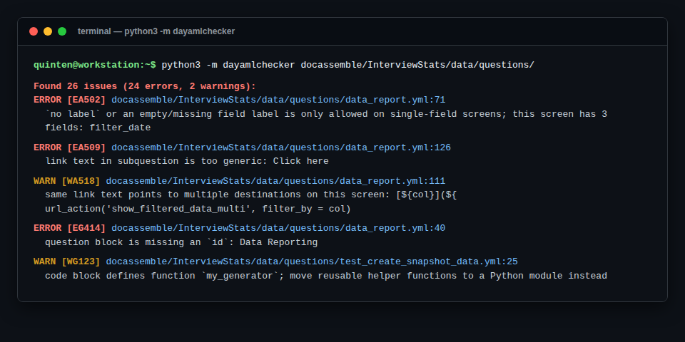

# DAYamlChecker: static analysis and linting

`dayamlchecker` is a static analysis tool for Docassemble packages. It reads interview
YAML, embedded Python and Mako, Python test modules, and Word (`.docx`) templates, and
reports broken interview logic, syntax errors, broken URLs, style problems, and Web
Content Accessibility Guidelines (WCAG) failures.



---

## Installation

`dayamlchecker` requires Python 3.12 or later.

```bash
# With pip
pip install dayamlchecker

# Or as a standalone tool with uv
uv tool install dayamlchecker
```

To work on `dayamlchecker` itself:

```bash
git clone https://github.com/SuffolkLITLab/DAYamlChecker.git
cd DAYamlChecker
pip install -e .
```

Installing provides two commands, `dayamlchecker` and `dayamlchecker-fmt` (a formatter
for interview YAML). The examples below use `python3 -m dayamlchecker`, which is
equivalent to running `dayamlchecker` and works even when the script directory is not on
your `PATH`.

---

## Running DAYamlChecker

Pass files or directories. Directories are searched recursively, skipping `.git*`,
`.github*`, `build`, `dist`, `node_modules`, and `sources` unless you pass `--check-all`.

```bash
# One interview
python3 -m dayamlchecker docassemble/MyPackage/data/questions/interview.yml

# Every interview in a package
python3 -m dayamlchecker docassemble/MyPackage/data/questions/

# Word templates
python3 -m dayamlchecker docassemble/MyPackage/data/templates/

# Both at once
python3 -m dayamlchecker docassemble/MyPackage/data/
```

---

## What DAYamlChecker checks

Findings belong to one of four classes: `general`, `accessibility`, `style`, and
`translatability`. Each finding has a code whose first letter is its severity (`E` error,
`W` warning, `I` info) and whose second letter is its class (`G`, `A`, `S`, `T`).

### 1. YAML structure and Docassemble integrity (`general`)

| Check area | Description | Example codes |
| :--- | :--- | :--- |
| YAML syntax | Unclosed quotes, indentation mistakes, invalid characters | `EG102` (YAML parse error) |
| Duplicate keys | A key repeated inside one block | `EG101` |
| Duplicate block ids | An `id:` reused across blocks, where Docassemble silently keeps the last one | `EG104` |
| Docassemble keys | Unrecognized keys in a block | `EG301` |
| Question ids | A `question` block with no `id:` | `EG414` |
| Mandatory logic | More than one unconditioned `mandatory: True` block | `WG415` |
| Field definitions | Empty `fields:`, fields that collect no input, empty variable targets | `EG418`, `EG420`, `EG421` |
| Test modules | A Python test module that does not start with `# do not pre-load`, which makes Docassemble import it during server startup | `EG105` |

### 2. Embedded Python, Mako, and JavaScript (`general`)

- **Python code blocks**: syntax errors (`EG122`), and a warning when a code block defines
  a function that belongs in a Python module instead (`WG123`).
- **Mako**: `${ ... }` expressions and `% if ...` control lines inside questions,
  subquestions, and field values (`EG111`, `EG112`), plus malformed Markdown links in
  Mako-rendered text (`WG113`).
- **JavaScript**: `datatype: js` expressions, including `.val()` calls and references to
  fields that are not on the screen (`EG204`–`EG207`).

### 3. WCAG and web accessibility (`accessibility`)

Accessibility checks run by default. Disable them with `--no-wcag`.

- **Heading structure**: skipped Markdown heading levels such as `##` to `####`
  (`EA506`), and the same in HTML (`EA507`).
- **Alt text**: Markdown images (`EA505`), HTML `` tags, and Docassemble
  `[FILE ...]` tags. Write `[FILE logo.png, alt="Suffolk LIT Lab logo"]`.
- **Link text**: empty links (`EA508`), non-descriptive text such as "click here",
  "here", "read more", and Spanish equivalents like "haga clic aquí" (`EA509`), the same
  link text pointing at different destinations (`WA518`), and links that open a new tab
  without telling the user (`WA519`).
- **Field labels**: `no label` and empty labels on screens with two or more fields
  (`EA502`), non-descriptive labels (`WA512`), and duplicate labels on one screen
  (`WA515`).
- **Comboboxes**: off by default while the rule is evaluated. Turn it on with
  `--accessibility-error-on-widget combobox` (`EA501`).
- **Custom theme contrast**: when a theme is loaded with `features: bootstrap theme:`,
  the CSS is parsed and body text, navbar links, dropdown items, and buttons are checked
  against a 4.5:1 minimum ratio (`EA504`).
- **Display templates**: templates shown with `display_template()` need a `subject`
  (`WA529`).
- **PDF tagging**: an informational note when an attachment does not set
  `tagged pdf: True` (`IA503`).

WCAG checks still report YAML parse errors, so one run surfaces both broken YAML and
accessibility failures. This is source analysis: it cannot see problems that only appear
in a rendered page or in JavaScript at runtime.

### 4. DOCX template accessibility (`accessibility`)

Any `.docx` file you pass is opened and its OpenXML structure inspected. These checks run
by default; `--no-docx-accessibility` skips them.

- **Alt text**: images (`WA541`), shapes and other objects (`WA542`), placeholder alt
  text (`WA548`), and alt text on images marked decorative (`WA547`).
- **Links**: empty link text (`WA543`), a raw URL used as link text (`WA549`), and
  ambiguous link text (`WA550`).
- **Document metadata**: missing document language (`WA545`) and missing document title
  (`IA561`).
- **Headings**: documents with no headings (`WA556`), empty headings (`WA555`), a first
  heading below level 1 (`WA557`), and skipped levels (`WA558`).
- **Tables**: no header row marker (`WA552`), merged cells (`WA546`), and tables that
  look like they are being used for layout (`WA551`).
- **Reading order**: floating objects (`WA553`) and text boxes (`WA554`) that pull text
  out of the main flow.
- **Spacing**: long runs of empty paragraphs used instead of paragraph spacing
  (`IA565`) and manually typed list numbering (`IA566`).

Because a DOCX has no line numbers, each finding names the package part it came from
(`word/document.xml`, `word/header1.xml`) and quotes up to 80 characters of nearby text
so you can search for it in Word:

```text
WARN  [WA552] docassemble/MyPackage/data/templates/discovery.docx
  a table in word/document.xml has no obvious header row marker
  (table begins "Certificate of Service")
```

:::tip DOCX findings are warnings by default
Every DOCX finding is capped at **warning** severity, so turning these checks on reports
problems without failing a build. Most existing templates have findings today, and the
intent is for authors to work through them over time. Pass
`--docx-accessibility-severity error` to restore each rule's own severity and fail on
errors.
:::

#### Why DOCX is checked here and PDF is checked with veraPDF

`dayamlchecker` checks DOCX templates directly, while PDF templates are validated by
**veraPDF** inside the [`da_build`](./github_actions.md#da_build) action. A DOCX is a zip
of XML that pure Python can read, so the check is fast and runs anywhere. Validating
PDF/UA-1 means implementing a large ISO specification, and veraPDF is the reference
implementation — but it is a Java application, and bundling a JRE into a Python linter
would be a heavy price for local use. So `da_build` installs veraPDF in CI, where a Java
runtime is already available.

### 5. Broken URLs

Absolute HTTP and HTTPS links in interview files, and in the `data/templates` files
those interviews sit alongside, are requested concurrently. A broken link in a question
file is an error; a broken link in a template is a warning by default.

```bash
# URL checking is on by default
python3 -m dayamlchecker docassemble/MyPackage/data/questions/

# Skip endpoints that block CI or are known to be flaky
python3 -m dayamlchecker --url-check-ignore-urls "https://flaky-court.gov,https://status.example.org" docassemble/MyPackage/data/questions/

# Turn it off, for example when working offline
python3 -m dayamlchecker --no-url-check docassemble/MyPackage/data/questions/
```

### 6. Style and translatability (`style`, `translatability`)

Assembly Line style checks are opt in.

```bash
# Deterministic style and translatability rules
python3 -m dayamlchecker --style docassemble/MyPackage/data/questions/

# Add rules backed by an OpenAI-compatible model
OPENAI_API_KEY="sk-..." python3 -m dayamlchecker --style-llm docassemble/MyPackage/data/questions/
```

`--style-llm` implies `--style`, and reads `OPENAI_BASE_URL`, `OPENAI_API_KEY`, and
`OPENAI_MODEL` from the environment when the matching flags are not given.

Style rules cover plain language, screen titles, overlong labels, too many fields on one
screen, review screens, and inclusive gender and pronoun fields. They also include the
rule that `#` and `<h1>` belong to the `question` itself and should not appear in a
`subquestion` (`ES701`).

Translatability rules use `WT` codes: choice lists whose labels are translated but whose
stored values are not invariant (`WT701`), user-facing strings written inside Python code
(`WT702`), and conditional expressions or Mako blocks that change only part of a sentence
and so cannot be translated as a unit (`WT703`, `WT704`).

---

## Suppressing findings

Suppress by code (`EA509`) or by finding class (`accessibility`, `style`,
`translatability`, `general`). `ALL` or `*` suppresses everything at that location.

### On one line

```yaml
subquestion: |
  Please [click here](https://example.com) for details.  # no-dayc: EA509
```

### For a whole block

Put `# no-dayc-block:` anywhere inside the block, usually just after the `---` separator:

```yaml
---
# no-dayc-block: accessibility, EG301
question: Custom widget
fields:
  - no label: custom_widget_data
```

### For a whole run

```bash
python3 -m dayamlchecker --suppress accessibility,EG101 docassemble/MyPackage/
```

:::note DOCX findings can only be suppressed on the command line
`# no-dayc:` and `# no-dayc-block:` comments live in YAML, and a Word document has
nowhere to put them. Silence a noisy DOCX rule with `--suppress` instead, for example
`--suppress IA561` for the missing document title.
:::

---

## Command line reference

| Flag | Description | Default |
| :--- | :--- | :--- |
| `files` | One or more YAML, Python, or DOCX files or directories | Required |
| `--suppress CODE` | Suppress a code or finding class; repeatable and comma-separated | none |
| `--check-all` | Search ignored directories too (`.git*`, `.github*`, `build`, `dist`, `node_modules`, `sources`) | off |
| `--no-wcag` | Turn off WCAG accessibility checks | WCAG on |
| `--accessibility-error-on-widget WIDGET` | Treat a widget, such as `combobox`, as an error | none |
| `--style` | Turn on Assembly Line style and translatability rules | off |
| `--style-llm` | Add LLM-backed style rules; implies `--style` | off |
| `--openai-base-url URL` | Base URL for an OpenAI-compatible API | `OPENAI_BASE_URL` |
| `--openai-api-key KEY` | API key for `--style-llm` | `OPENAI_API_KEY` |
| `--openai-model MODEL` | Model name for `--style-llm` | `OPENAI_MODEL`, else `gpt-4o-mini` |
| `--url-check` / `--no-url-check` | Check that URLs resolve | on |
| `--url-check-timeout SECONDS` | Per-request HTTP timeout | `10` |
| `--url-check-root PATH` | Repository root used to find related template files | inferred |
| `--url-check-ignore-urls URLS` | Comma- or newline-separated URLs to skip | none |
| `--url-check-skip-templates` | Do not check URLs inside `data/templates` files | off |
| `--template-url-severity CHOICE` | Severity for broken template URLs: `error`, `warning`, `ignore` | `warning` |
| `--unreachable-url-severity CHOICE` | Severity for URLs that could not be reached at all | `warning` |
| `--docx-accessibility` / `--no-docx-accessibility` | Check DOCX templates | on |
| `--docx-accessibility-severity CHOICE` | Severity cap for DOCX findings: `warning` or `error` | `warning` |
| `--format CHOICE` | `text`, or `github` for GitHub Actions annotations | `text` |
| `--max-warnings N` | Fail if more than N warnings are reported | no limit |

---

## Python API

```python
from dayamlchecker import (
    RuntimeOptions,
    find_errors_from_string,
    find_style_findings_from_string,
)

yaml_code = """
id: user_income
question: What is your income?
fields:
  - Income: user_income
    datatype: currency
"""

for finding in find_errors_from_string(yaml_code, input_file="interview.yml"):
    print(f"[{finding.code}] {finding.message} (line {finding.line_number})")

style_findings = find_style_findings_from_string(
    yaml_code,
    input_file="interview.yml",
    runtime_options=RuntimeOptions(style_enabled=True),
)
```

---

## Related documentation

- **[Running checks before you push](./running_checks_locally.md)**
- **[GitHub Actions](./github_actions.md)**
- **[Logs and artifacts](./navigating_logs_and_artifacts.md)**
- **[Making Docassemble interviews accessible](../coding_style/accessibility.md)**
