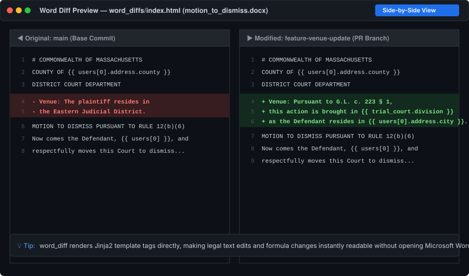

# Assembly Line GitHub Actions (ALActions)

The **[SuffolkLITLab/ALActions](https://github.com/SuffolkLITLab/ALActions)** repository provides a suite of reusable GitHub Actions specifically designed for Docassemble interview packages. 

These composite actions automate linting, syntax compilation, DOCX template validation, visual Word diffs, accessibility auditing with **veraPDF**, automated playground deployments, and server health monitoring.

---

## Action Catalog Overview

| Action | Primary Use Case | Triggers | Key Artifacts / Summaries |
| :--- | :--- | :--- | :--- |
| **[`da_build`](#da_build)** | Package build, Python compile, YAML linting, URL check, PDF accessibility | `push`, `pull_request` | GitHub Annotations for broken URLs and PDF/UA-1 failures |
| **[`valid_jinja2`](#valid_jinja2)** | Validates Jinja2 expressions inside `.docx` Word templates | `push`, `pull_request` (on `.docx` paths) | Step Summary table and `jinja-validation` HTML artifact |
| **[`word_diff`](#word_diff)** | Converts changed `.docx` templates to Markdown and HTML visual diffs | `pull_request`, `workflow_dispatch` | Markdown diff in Step Summary and `word-doc-diff` HTML bundle |
| **[`black-formatting`](#black-formatting)** | Enforces PEP 8 Python formatting via Black | `push`, `pull_request` | Formatting failure diffs in job log |
| **[`docsig`](#docsig)** | Checks Google-style Python docstrings against function signatures | `push`, `pull_request` | Docstring signature mismatch warnings |
| **[`pythontests`](#pythontests)** | Executes automated Python unit tests (`unittest`) | `push`, `pull_request` | Test run output and coverage |
| **[`da_playground_install`](#da_playground_install)** | Deploys package to a specific Docassemble playground project | `push` (branches / feature branches) | Live interview instance in developer playground |
| **[`da_package`](#da_package)** | Installs package server-wide on a Docassemble server | `push` (e.g. `main` or release tags) | Server-wide package deployment |
| **[`hall_monitor`](#hall_monitor)** | Synthetic uptime monitoring of live interviews on a server | `schedule` (cron) | Alerts via SendGrid, Mailgun, or Microsoft Teams |

---

## `da_build`: Comprehensive Package & YAML Check {#da_build}

`da_build` is the primary build and validation action for Docassemble packages. It performs the following steps:

1. **Python Compilation**: Runs `python -m compileall .` to ensure all Python source files are syntactically valid.
2. **Package Build**: Uses `uv build` to build binary wheels and source tarballs in `dist/`.
3. **YAML Verification**: Executes [`dayamlchecker`](./dayamlchecker.md) across all interview YAML files under `docassemble/*/data/questions/`.
4. **URL Checking**: Concurrently checks all absolute URLs in question files and template files, reporting broken links and redirects as GitHub Actions annotations.
5. **PDF Accessibility Auditing**: Downloads **veraPDF** (PDF/UA-1 validation engine) and verifies that all PDF templates in `data/templates/` comply with PDF/UA-1 accessibility standards.

### Sample Workflow

Create `.github/workflows/build_and_check.yml`:

```yaml
name: Build and Check Package

on:
  push:
    branches: [main]
  pull_request:
    branches: [main]
  workflow_dispatch:

jobs:
  build-and-validate:
    runs-on: ubuntu-latest
    steps:
      - name: Build, Lint, and Check
        uses: SuffolkLITLab/ALActions/da_build@main
        with:
          python-version: "3.12"
          # Optional: ignore known flaky or rate-limited external domains
          ignore-urls: |
            https://example.com/known-flaky-endpoint
            https://masscourts.gov/status
          # Optional: 'warning' (default), 'error', or 'off'
          pdf-validation-mode: "warning"
          pdf-strict: "false"
```

### Action Inputs

| Input | Description | Default | Required |
| :--- | :--- | :--- | :--- |
| `python-version` | Python version for virtual environment and uv | `"3.12"` | No |
| `skip-url-check` | Set to `"true"` to disable external URL network validation | `"false"` | No |
| `skip-templates` | Set to `"true"` to skip URL checks in `data/templates/` | `"false"` | No |
| `ignore-urls` | Comma- or newline-separated absolute URLs to ignore in URL checks | `""` | No |
| `pdf-validation-mode` | How to report veraPDF PDF/UA-1 failures (`"warning"`, `"error"`, `"off"`) | `"warning"` | No |
| `pdf-strict` | Set to `"true"` to enable strict PDF/UA-1 checking on form field tab order | `"false"` | No |

---

## `valid_jinja2`: DOCX Template Expression Validator {#valid_jinja2}

Docassemble uses `docxtpl` (Jinja2) to assemble Microsoft Word documents. A single typographical error like `{{ user.firs_name }}` or an unclosed `` tag can cause a live interview to crash when generating a document.

`valid_jinja2` inspects all modified and newly added `.docx` files in a pull request:

- **Syntax Errors**: Invalid Jinja expressions (e.g. unclosed tags, malformed expressions) fail the build.
- **Custom Filter Awareness**: Recognizes over 70 common Docassemble and Assembly Line filters (such as `currency`, `date`, `title_case`, `phone_number_3_parts`, `word`, `ordinal`, `comma_and_list`). Unknown filters emit non-blocking warnings.
- **GitHub Step Summary**: Automatically posts a formatted Markdown summary directly into the GitHub Actions run summary.
- **HTML Artifacts**: Generates detailed AST validation reports uploaded as artifacts.

### Sample Workflow

Create `.github/workflows/validate_docx.yml`:

```yaml
name: Validate DOCX Templates

on:
  pull_request:
    paths:
      - '**/*.docx'
  push:
    paths:
      - '**/*.docx'
  workflow_dispatch:

jobs:
  validate-templates:
    runs-on: ubuntu-latest
    steps:
      - name: Validate DOCX Jinja2 templates
        uses: SuffolkLITLab/ALActions/valid_jinja2@main
        with:
          artifact_name: jinja-validation-report
          output_dir: jinja_validation
          summary_file: jinja_validation_summary.md
```

### Action Inputs

| Input | Description | Default | Required |
| :--- | :--- | :--- | :--- |
| `base_ref` | Git comparison base (auto-detected from pull request) | Auto | No |
| `working_directory` | Relative working directory path | `.` | No |
| `artifact_name` | Name of the uploaded artifact bundle | `jinja-validation` | No |
| `output_dir` | Directory where HTML reports are stored | `jinja_validation` | No |
| `summary_file` | Path for Markdown summary file | `jinja_validation_summary.md` | No |
| `skip_checkout` | Set to `"true"` if repository checkout was handled earlier | `"false"` | No |

---

## `word_diff`: Visual Diffing for Word Templates {#word_diff}

Reviewing binary `.docx` files in GitHub pull requests is notoriously difficult because GitHub only shows binary file replacements.

`word_diff` extracts the text of changed `.docx` files, converts them into cleanly wrapped Markdown, and generates side-by-side HTML diffs:



### Key Features

1. **Inline Step Summary**: Displays unified line-by-line diffs in the GitHub Actions Step Summary.
2. **Rich HTML Artifact**: Generates a side-by-side HTML comparison complete with an `index.html` table of contents for downloading and reviewing in any web browser.
3. **Template Tag Preservation**: Retains Jinja2 variables (`{{ ... }}`) and formatting tags in the diff so you can review changes to both text and dynamic logic.

### Sample Workflow

Create `.github/workflows/word_diff.yml`:

```yaml
name: Diff Word Documents

on:
  pull_request:
    paths:
      - '**/*.docx'
  workflow_dispatch:

jobs:
  docx-diff:
    runs-on: ubuntu-latest
    steps:
      - name: Diff Word documents
        uses: SuffolkLITLab/ALActions/word_diff@main
        with:
          artifact_name: word-doc-diff
          output_dir: word_diffs
          summary_file: word_diff_summary.md
```

---

## `black-formatting`: Python Code Formatter {#black-formatting}

`black-formatting` runs [Black](https://black.readthedocs.io/en/stable/) across all Python files in the repository.

```yaml
jobs:
  lint-python:
    runs-on: ubuntu-latest
    steps:
      - name: Check Python formatting
        uses: SuffolkLITLab/ALActions/black-formatting@main
```

You can configure Black options in your repository's `pyproject.toml`:

```toml
[tool.black]
line-length = 88
extend-exclude = '(__init__.py|setup.py)'
```

---

## `docsig`: Python Docstring Validation {#docsig}

`docsig` verifies that Python docstrings match function and method signatures (checking parameter names, return types, and docstring formatting). Assembly Line packages adhere to **Google-style docstrings**.

```yaml
jobs:
  docstrings:
    runs-on: ubuntu-latest
    steps:
      - name: Validate docstrings
        uses: SuffolkLITLab/ALActions/docsig@main
```

---

## `pythontests`: Python Unit Tests {#pythontests}

`pythontests` sets up an isolated Python environment and runs the package's [`unittest`](https://docs.python.org/3/library/unittest.html) test suite.

```yaml
jobs:
  test-python:
    runs-on: ubuntu-latest
    steps:
      - name: Run unit tests
        uses: SuffolkLITLab/ALActions/pythontests@main
```

---

## `da_playground_install` & `da_package`: Automated Deployments {#da_playground_install}

These actions automate deploying your interview package to test servers or developer playgrounds.

### Deploy to Playground (`da_playground_install`)

Useful for feature branch reviews where you want testers to interact with the interview on a staging Docassemble server:

```yaml
name: Deploy to Playground

on:
  push:
    branches:
      - 'feature/**'

jobs:
  deploy-playground:
    runs-on: ubuntu-latest
    steps:
      - name: Checkout Repository
        uses: actions/checkout@v4

      - name: Deploy to Docassemble Playground
        uses: SuffolkLITLab/ALActions/da_playground_install@main
        with:
          SERVER_URL: ${{ secrets.SERVER_URL }}
          DOCASSEMBLE_DEVELOPER_API_KEY: ${{ secrets.DOCASSEMBLE_DEVELOPER_API_KEY }}
          PROJECT_NAME: "test-review-${{ github.ref_name }}"
```

### Install Server-Wide (`da_package`)

Installs the package server-wide on a staging or production Docassemble server:

```yaml
name: Deploy Package Server-Wide

on:
  push:
    branches:
      - main

jobs:
  deploy-package:
    runs-on: ubuntu-latest
    steps:
      - name: Deploy Package
        uses: SuffolkLITLab/ALActions/da_package@main
        with:
          SERVER_URL: ${{ secrets.PROD_SERVER_URL }}
          DOCASSEMBLE_DEVELOPER_API_KEY: ${{ secrets.DOCASSEMBLE_DEVELOPER_API_KEY }}
```

---

## `hall_monitor`: Synthetic Uptime Monitoring {#hall_monitor}

`hall_monitor` tests a live Docassemble server on a scheduled interval. It visits every installed interview and verifies that the initial screen loads without a 500 error or exception.

When an error occurs, `hall_monitor` sends instant alert notifications via **SendGrid**, **Mailgun**, or **Microsoft Teams** webhooks:

```yaml
name: Hall Monitor Uptime Check

on:
  schedule:
    # Run every morning at 7:00 AM UTC and evening at 7:00 PM UTC
    - cron: "0 7,19 * * *"
  workflow_dispatch:

jobs:
  monitor-server:
    runs-on: ubuntu-latest
    steps:
      - name: Run Hall Monitor
        uses: SuffolkLITLab/ALActions/hall_monitor@main
        with:
          SERVER_URL: "https://apps.example.org"
          SENDGRID_API_KEY: ${{ secrets.SENDGRID_API_KEY }}
          ERROR_FROM_EMAIL: "alerts@example.org"
          ERROR_EMAILS: "dev-team@example.org,admin@example.org"
          # Or Microsoft Teams webhook:
          # TEAMS_WEBHOOK_URL: ${{ secrets.TEAMS_WEBHOOK_URL }}
```

---

## Standard Production Quality Workflow Template

Here is a recommended `.github/workflows/quality_checks.yml` configuration combining all static validation, template verification, and code formatting into a single cohesive CI pipeline:

```yaml
name: Quality Checks & Validation

on:
  push:
    branches: [main]
  pull_request:
    branches: [main]
  workflow_dispatch:

jobs:
  # 1. Package build, YAML linting, URL check, and veraPDF
  package-build-and-lint:
    runs-on: ubuntu-latest
    steps:
      - name: Build, Lint, and Check
        uses: SuffolkLITLab/ALActions/da_build@main
        with:
          python-version: "3.12"
          pdf-validation-mode: "warning"

  # 2. DOCX Jinja2 syntax validation
  validate-docx-templates:
    runs-on: ubuntu-latest
    steps:
      - name: Validate DOCX Jinja2 Expressions
        uses: SuffolkLITLab/ALActions/valid_jinja2@main

  # 3. Word document visual diffs on PRs
  diff-word-documents:
    if: github.event_name == 'pull_request'
    runs-on: ubuntu-latest
    steps:
      - name: Diff Word Documents
        uses: SuffolkLITLab/ALActions/word_diff@main

  # 4. Python code formatting and docstrings
  python-quality:
    runs-on: ubuntu-latest
    steps:
      - uses: actions/checkout@v4
      - name: Check Black Formatting
        uses: SuffolkLITLab/ALActions/black-formatting@main
      - name: Check Docstrings
        uses: SuffolkLITLab/ALActions/docsig@main
      - name: Run Unit Tests
        uses: SuffolkLITLab/ALActions/pythontests@main
```

---

## Related Documentation

- **[Navigating Logs and Artifacts](./navigating_logs_and_artifacts.md)**: Visual guide on reading step summaries, downloading artifacts, and searching logs.
- **[DAYamlChecker Guide](./dayamlchecker.md)**: Deep dive into the static YAML, accessibility, and DOCX checker.
- **[Automated Testing with ALKiln](../components/ALKiln/intro.mdx)**: Browser-based end-to-end testing.
