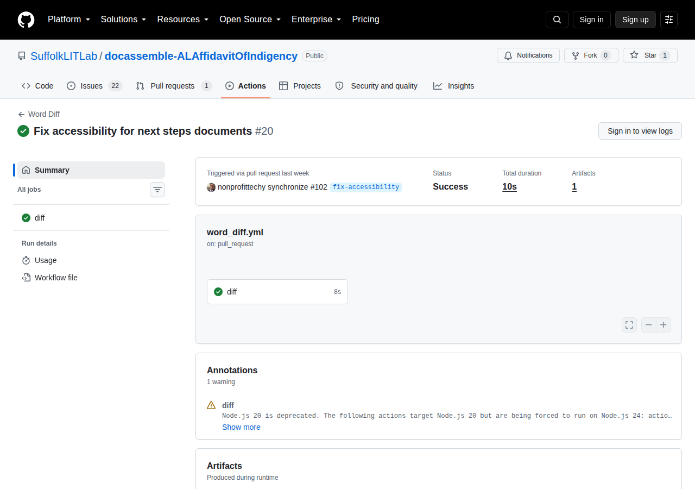
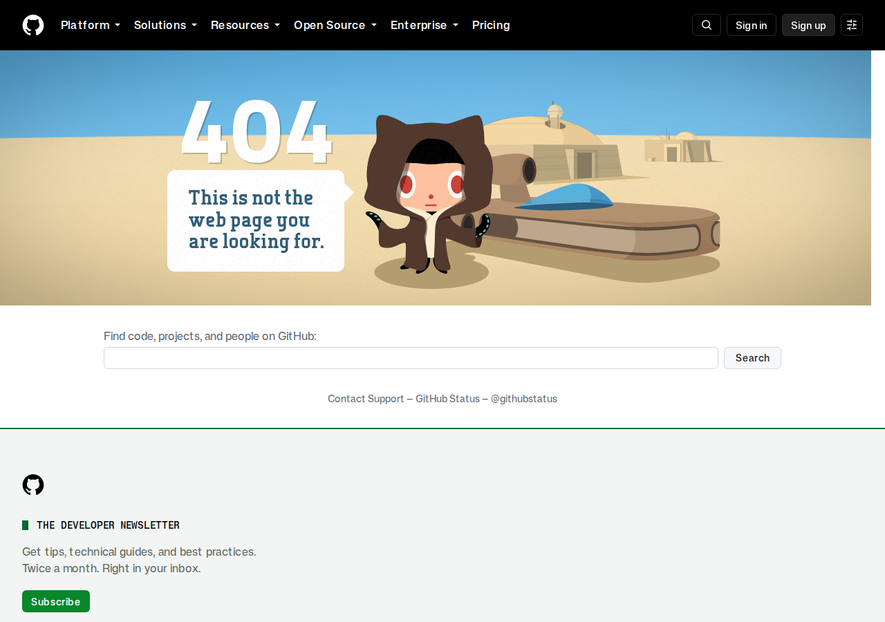

# Navigating logs, summaries, and artifacts

When you push code or open a pull request on GitHub, the Assembly Line quality pipeline automatically analyzes your interview YAML files, Python code, DOCX templates, and PDF documents.

This guide walks you through inspecting workflow summaries, downloading Word diff artifacts, and searching job execution logs to diagnose and fix issues quickly.

---

## 1. Finding the workflow run on GitHub

### From a pull request
1. Open your pull request in GitHub.
2. Scroll to the bottom merge status box.
3. Next to any check (e.g. `build-and-validate`, `validate-docx`, `docx-diff`), click **Details** to open the run page.
4. Alternatively, click the **Checks** tab at the top of the pull request to view all running and completed jobs.

### From the Actions tab
1. Click the **Actions** tab in your repository's top navigation bar.
2. Click the latest workflow run (e.g., *Quality Checks & Validation*).

---

## 2. Inspecting the workflow summary

The **Summary** page provides an immediate high-level overview of the pipeline results:

### What to look for:
1. **Annotations box**: Located near the top. Highlights URL warnings (e.g., HTTP 302 redirects or slow responses) and veraPDF accessibility notices.
2. **DOCX Jinja2 validation summary**: Renders a table detailing all modified Word templates, indicating whether their Jinja expressions compiled successfully and listing any recognized custom filters.
3. **Word document diff summary**: Displays a markdown table summarizing modified template files, number of lines changed, and high-level descriptions.
4. **Artifacts download section**: Located at the bottom of the Summary page. Contains downloadable `.zip` bundles containing rich HTML reports and side-by-side diff previews.

---

## 3. Viewing Word diffs (`word_diff` artifacts)

Unlike linting tools that only produce output when code fails, the `word_diff` action **generates a diff report on every pull request that touches `.docx` templates, even when nothing is wrong**. Its purpose is to solve the classic challenge of reviewing binary Word documents in Git by providing human-readable visual diffs for authors and peer reviewers.

### Step-by-step navigation to the Word diff report:

Because GitHub separates job logs, step summaries, and downloadable artifacts, follow this exact click sequence to access and view the HTML diff:

1. **Open your Pull Request**:
   - Navigate to your pull request on GitHub.
2. **Go to the Workflow Run**:
   - **Method A (from Conversation tab)**: Scroll to the bottom merge status checks box. Next to the `docx-diff` or `Word Diff` check, click **Details**.
   - **Method B (from Checks tab)**: Click the **Checks** tab at the top of the pull request, then click the `docx-diff` workflow on the left sidebar.
3. **Click the "Summary" Tab**:
   - GitHub often opens the dark terminal log viewer by default. Look at the top of the left-hand sidebar and click **Summary** (next to the workflow title) to open the run overview.
4. **Locate and download the Artifact**:
   - Scroll all the way to the bottom of the Summary page to the **Artifacts** section.
   - Click on **`word-doc-diff`** (or your repository's configured artifact name). GitHub will automatically download a `.zip` archive to your computer.
5. **Extract and view in any browser**:
   - Unzip the downloaded file on your computer.
   - Double-click **`index.html`** to open it in your preferred web browser (Chrome, Firefox, Safari, Edge).
   - Click on any changed template in the sidebar or document list to view the side-by-side comparison:
     - **Red / strikethrough text**: Deleted wording or old tags.
     - **Green highlighted text**: Newly added text or updated Jinja2 expressions (`{{ ... }}`).

:::tip Reviewing Jinja2 variables in Word
Because `word_diff` preserves Jinja2 tags and conditional statements, you can easily verify variable name updates (such as renaming `{{ user.name }}` to `{{ users[0].name.full() }}`) without needing Microsoft Word installed.
:::

---

## 4. Navigating and searching job logs

When a check fails or you need more context on a warning, jump into the job execution logs:

### Navigating the log viewer:
1. In the left sidebar, click on the failing job (e.g., `build-n-check`).
2. Click on any collapsed step header (such as **`Run YAML Checker`**, **`Check URLs in question/template files`**, or **`Check PDF accessibility with veraPDF`**) to expand its logs.
3. Use the search bar in the top-right corner of the log window (or press `Ctrl+F` / `Cmd+F`) to search for specific diagnostic codes or filenames:
   - Search `[EA` or `ERROR` for accessibility and YAML errors.
   - Search `[WA` or `WARN` for warnings.
   - Search `HTTP` for URL check responses.
   - Search `veraPDF` for PDF/UA-1 rule validation failures.

---

## 5. Viewing pull request annotations

GitHub Actions automatically maps `dayamlchecker` and URL check findings directly onto the pull request's **Files changed** tab:

- Line-level errors (such as missing labels or skipped heading levels) appear as inline comments directly beneath the offending line in your YAML file.
- Clicking on an annotation reveals the diagnostic code (e.g. `[EA501]`) and a plain-language explanation of how to resolve the issue.

---

## 6. Troubleshooting common CI failures

### 1. `YAML_PARSE_ERROR` or `yaml_duplicate_key`
- **Symptom**: `dayamlchecker` fails during the `Run YAML Checker` step.
- **Cause**: An unescaped character, incorrect YAML indentation, or a duplicated key within a question block.
- **Fix**: Check the line number reported in the log and fix the indentation or remove the duplicate key.

### 2. `accessibility_markdown_heading_level_skip` (`[EA501]`)
- **Symptom**: Step fails with heading level jump.
- **Cause**: The markdown uses `#### Heading 4` directly beneath `## Heading 2`.
- **Fix**: Change the heading to `### Heading 3`. If you want smaller visual styling, use HTML utility classes like `<h3 class="h5">Heading Text</h3>`.

### 3. Broken URL / 404 failure
- **Symptom**: URL Checker step fails with HTTP 404 or connection timeout.
- **Cause**: An external link in a question or template is invalid or points to a non-existent page.
- **Fix**:
  - Update the URL to the correct destination.
  - If the link requires authentication or blocks CI bots, add it to `ignore-urls` in your workflow configuration.

### 4. veraPDF PDF/UA-1 failure (`check_pdf_accessibility.py`)
- **Symptom**: `da_build` reports PDF accessibility warnings or fails the build.
- **Cause**: A PDF template in `data/templates/` is not properly tagged for screen readers.
- **Fix**: Open the source PDF in Adobe Acrobat Pro, run the **Accessibility Check**, and resolve tagging issues. If the form will be flattened at runtime, ensure `pdf-strict: "false"` is set in your workflow.

---

## Related documentation

- **[Automated quality checks overview](./overview.md)**: Introduction to the Assembly Line quality pipeline.
- **[DAYamlChecker documentation](./dayamlchecker.md)**: Full guide to diagnostic codes and suppression options.
- **[GitHub Actions catalog](./github_actions.md)**: Complete configuration options for all `SuffolkLITLab/ALActions`.
