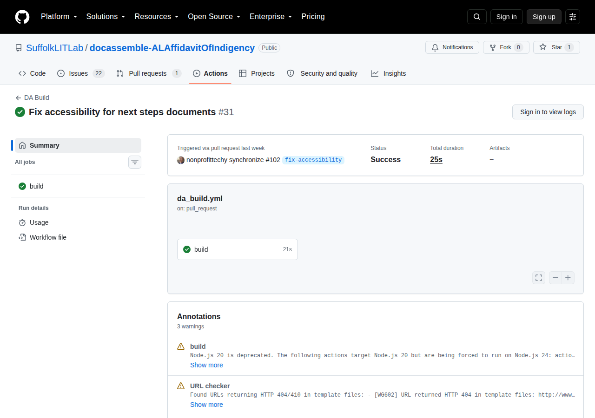
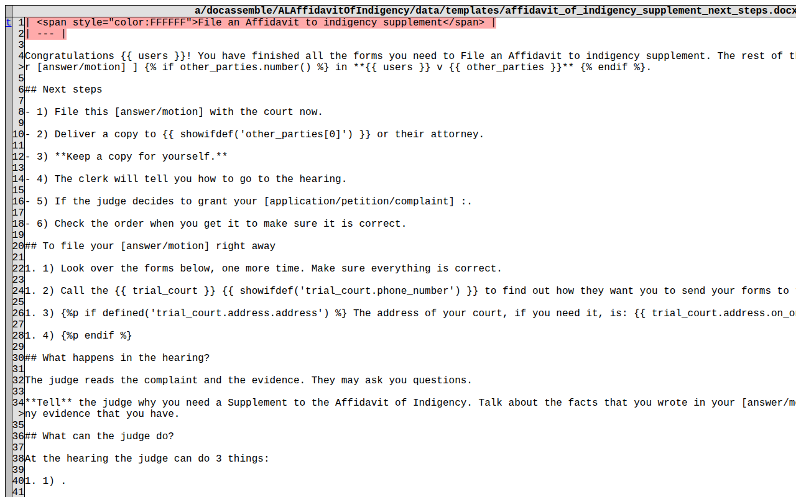

# Navigating logs, summaries, and artifacts

When a check reports something, the result can land in one of four places: an inline
annotation on the **Files changed** tab, an annotation box on the run's **Summary** page,
a Markdown step summary, or a downloadable artifact. This page explains which is which
and how to get to each one.

---

## Finding the workflow run

From a pull request, open the **Checks** tab, or scroll to the merge box at the bottom of
the **Conversation** tab and click **Details** next to a check. From the repository,
open the **Actions** tab and click the run.

---

## Reading the run summary

- **Annotations**, near the top, collect everything the run reported as a workflow
  command: `dayamlchecker` findings, the URL checker's warning block, and veraPDF
  failures.
- **Step summaries** are rendered below: the Jinja2 validation table from
  `valid_jinja2`, the per-file diffs from `word_diff`, and the PDF accessibility section
  from `da_build`.
- **Artifacts**, at the very bottom, are the downloadable `.zip` bundles.

:::note GitHub only shows the first ten annotations
GitHub keeps at most ten annotations per severity per run. `dayamlchecker` sorts its
findings so that the most severe ones survive that cut, and also prints the complete
report into the job log — so if the annotation list looks suspiciously short, the full
list is in the log for that step.
:::

---

## Annotations on the Files changed tab

`da_build` runs `dayamlchecker` with `--format github`, so findings become annotations
carrying a file, a line, and the diagnostic code as their title. A finding on a line you
changed appears inline on the **Files changed** tab, directly under the offending line.

Two kinds of finding cannot be anchored to a line, and appear in the run's annotation box
instead:

- **DOCX findings**, because a Word document has no line numbers. They name the package
  part instead (`word/document.xml`) and quote nearby text.
- **URL checker warnings**, which are collected into a single annotation titled
  `URL checker`.

---

## Word diffs

`word_diff` is not a pass/fail check. On any pull request that touches a `.docx` file it
produces a report, whether or not anything is wrong.

The unified diff in the step summary is usually enough. For the side-by-side view:

1. Open the run, as above, and click **Summary** in the left sidebar — GitHub often opens
   the log viewer first.
2. Scroll to **Artifacts** at the bottom and click **`word-doc-diff`** (or whatever
   `artifact_name` you configured). GitHub downloads a `.zip`.
3. Unzip it and open **`index.html`** in any browser, then pick a template from the list.
   Red or struck-through text was removed; green text was added.

:::tip Reviewing Jinja2 without Word
Because `word_diff` diffs the text including its Jinja2 tags, you can confirm a rename
from `{{ user.name }}` to `{{ users[0].name.full() }}` in the browser, with no copy of
Microsoft Word involved.
:::

---

## Searching the job logs

Click a job in the left sidebar, then click a step header — `Run YAML and template
document checker`, `Check URLs in question/template files`, or `Check PDF accessibility
with veraPDF` — to expand it. The search box at the top right of the log pane searches
the whole job:

- `ERROR` or `WARN` for severity, or `[EA` and `[WA` for accessibility findings
  specifically.
- `[EG` for interview structure and syntax findings.
- `HTTP` for URL checker results.
- `veraPDF` for PDF/UA-1 rule failures.

---

## Common failures

**A YAML error (`EG102`, `EG101`)** — the `dayamlchecker` step fails on a parse error or
a duplicate key. The annotation names the line; fix the indentation, quoting, or
duplicate.

**A skipped heading (`EA506`)** — a screen jumps from `##` to `####`. Use the next level
down instead. If you wanted smaller text rather than a lower level, keep the level and
style it: `<h3 class="h5">Heading text</h3>`.

**A broken URL (`EG602`)** — a link in a question file returned an error. Fix the link,
or, if the destination blocks CI or rate-limits it, add it to `ignore-urls` in your
workflow. Broken links in `data/templates` are warnings rather than failures.

**A PDF/UA-1 failure** — a PDF template is not properly tagged. Open it in Acrobat Pro,
run the accessibility check, and fix the tagging. If the form is flattened before users
see it, leave `pdf-strict` at `"false"` so tab-order rules do not count against you.

**A DOCX accessibility finding (`WA5…`)** — a warning by default, so it will not fail the
build. Work through them with the [DOCX accessibility
rules](./dayamlchecker.md#4-docx-template-accessibility-accessibility).

---

## Related documentation

- **[Automated quality checks overview](./overview.md)**
- **[DAYamlChecker](./dayamlchecker.md)**
- **[GitHub Actions](./github_actions.md)**
