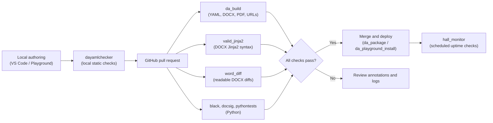

# Automated quality checks in Assembly Line

Docassemble interviews combine several languages in one package: YAML for interview
logic, Python for data models, Mako and Jinja2 for templating, Markdown and HTML for
screen formatting, and DOCX and PDF for the documents users receive. The Document
Assembly Line runs a set of automated checks over all of them, so that broken links,
template typos, and accessibility barriers are caught in a pull request instead of by a
self-represented litigant.

---

## What the checks catch

1. **Accessibility barriers**: skipped heading levels, unlabelled fields, missing image
   alt text, low contrast in custom themes, and untagged PDFs.
2. **Template and syntax errors**: broken Jinja2 expressions (`{{ user.nam }}` instead of
   `{{ user.name }}`), malformed Mako, and invalid YAML, before a user hits a runtime
   exception.
3. **Broken links**: every absolute HTTP and HTTPS link in interview screens and
   templates is requested, so users never land on a dead page.
4. **Document drift**: the exact text that changed in a Word template, readable in a pull
   request without opening Microsoft Word.
5. **Python style and correctness**: Black formatting, docstrings that match their
   signatures, type checks, a security scan, and unit tests.
6. **Server health**: scheduled checks that every installed interview on a live server
   still loads.

---

## The toolchain

| Tool or action | Scope | What it does | How it runs |
| :--- | :--- | :--- | :--- |
| **[`dayamlchecker`](./dayamlchecker.md)** | YAML, Python, DOCX, URLs | Static checker for interview structure, WCAG failures, DOCX accessibility, and broken links | Locally from the command line, and inside `da_build` |
| **[`ALActions/da_build`](./github_actions.md#da_build)** | Package build, YAML, DOCX, PDF, URLs | Builds the package, runs `dayamlchecker` over interview YAML and DOCX templates, audits PDF templates with veraPDF, and checks URLs | GitHub Actions |
| **[`ALActions/valid_jinja2`](./github_actions.md#valid_jinja2)** | DOCX templates | Compiles the Jinja2 expressions in changed `.docx` files, recognizing 124 Docassemble and Jinja2 filters | GitHub Actions |
| **[`ALActions/word_diff`](./github_actions.md#word_diff)** | DOCX templates | Converts changed `.docx` files to Markdown and side-by-side HTML diffs | GitHub Actions |
| **[`ALActions/black-formatting`](./github_actions.md#black-formatting)** | Python | Enforces Black formatting | GitHub Actions |
| **[`ALActions/docsig`](./github_actions.md#docsig)** | Python docstrings | Checks that Google-style docstrings match function signatures | GitHub Actions |
| **[`ALActions/pythontests`](./github_actions.md#pythontests)** | Python | Runs Mypy, Bandit, and the `pytest` suite | GitHub Actions |
| **[`ALActions/da_playground_install`](./github_actions.md#da_playground_install)** | Deployment | Installs the branch into a Docassemble playground project for manual testing | GitHub Actions |
| **[`ALActions/da_package`](./github_actions.md#da_package)** | Deployment | Installs the package server-wide on a test or staging server | GitHub Actions |
| **[`ALActions/hall_monitor`](./github_actions.md#hall_monitor)** | Monitoring | Checks that installed interviews on a live server still load, and alerts by email or Teams | GitHub Actions, on a cron schedule |

:::note Static and dynamic testing are complementary
These checks are **static**: they run in seconds in a lightweight container, reading
source code, templates, and documents without booting a Docassemble server. They cannot
tell you whether an interview actually works. For that, use
**[ALKiln](../components/ALKiln/intro.mdx)**, which drives a headless browser through a
real interview on a running server.
:::

---

## What a run looks like

---

## Next steps

- **[Running checks before you push](./running_checks_locally.md)**: command line checks
  and Git pre-commit hooks.
- **[DAYamlChecker](./dayamlchecker.md)**: what it checks, what the diagnostic codes
  mean, and how to suppress a finding.
- **[GitHub Actions](./github_actions.md)**: every action in
  `SuffolkLITLab/ALActions`, with workflows you can copy.
- **[Logs and artifacts](./navigating_logs_and_artifacts.md)**: reading annotations,
  step summaries, and downloadable reports.
