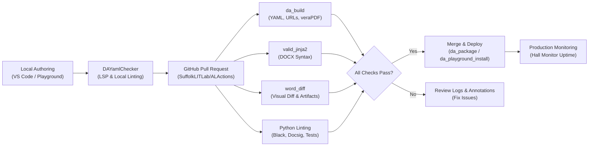

# Automated Quality Checks in Assembly Line

Maintaining high quality, security, and accessibility in legal tech applications requires rigorous testing at every stage of the authoring lifecycle. In the Document Assembly Line project, automated quality checks ensure that interview code, template files, hyperlinks, and document outputs are continuously validated before they reach end users.

---

## Why Automated Quality Checks Matter

Docassemble interviews combine multiple languages and technologies: YAML for interview logic, Python for backend data models, Mako and Jinja2 for text templating, Markdown and HTML for screen formatting, and DOCX/PDF for document assembly. Automated quality checks catch issues early:

1. **Accessibility Barriers**: Preventing WCAG failures such as skipped heading levels, unlabelled fields, missing image alt text, low color contrast, and untagged PDFs.
2. **Template & Syntax Errors**: Catching broken Jinja2 expressions (`{{ user.nam }}` vs `{{ user.name }}`), malformed Mako logic, and invalid YAML blocks before a user triggers a runtime exception.
3. **Broken & Flaky Links**: Automatically scanning all external HTTP/HTTPS links in interview screens and templates so self-represented litigants never encounter dead resources.
4. **Document Visual Drift**: Revealing exact text changes in Word `.docx` templates during code review without needing Microsoft Word installed.
5. **Code Style & Maintainability**: Enforcing PEP 8 standards with Black, ensuring docstring parity with Docsig, and running automated Python unit tests.
6. **Continuous Server Health**: Continuously testing live servers and interviews with Hall Monitor to verify that all deployed interviews load their first page successfully.

---

## The Quality Check Toolchain

The Assembly Line quality ecosystem consists of several complementary tools:

| Tool / Action | Scope | Primary Purpose | How It Runs |
| :--- | :--- | :--- | :--- |
| **[`dayamlchecker`](./dayamlchecker.md)** | YAML, Python, DOCX, URLs | Language server, static linter, WCAG auditor, DOCX accessibility checker, and broken link validator | Locally via CLI (`pip install dayamlchecker`), inside IDEs via LSP, or in CI |
| **[`ALActions/da_build`](./github_actions.md#da_build)** | Package Build, YAML, PDF | Builds Python wheels/tarballs, runs `dayamlchecker`, validates URLs, and audits PDF templates using **veraPDF** (PDF/UA-1) | GitHub Actions CI workflow |
| **[`ALActions/valid_jinja2`](./github_actions.md#valid_jinja2)** | DOCX Templates | Validates Jinja2 templating expressions across modified `.docx` files, recognizing 70+ Docassemble/AssemblyLine filters | GitHub Actions CI workflow |
| **[`ALActions/word_diff`](./github_actions.md#word_diff)** | DOCX Templates | Converts changed `.docx` files to Markdown and side-by-side HTML diffs for instant review in GitHub pull requests | GitHub Actions CI workflow |
| **[`ALActions/black-formatting`](./github_actions.md#black-formatting)** | Python Code | Enforces standardized Python code formatting | GitHub Actions CI workflow |
| **[`ALActions/docsig`](./github_actions.md#docsig)** | Python Docstrings | Ensures Google-style docstrings match function and method signatures | GitHub Actions CI workflow |
| **[`ALActions/pythontests`](./github_actions.md#pythontests)** | Python Tests | Discovers and executes standard `unittest` test suites | GitHub Actions CI workflow |
| **[`ALActions/da_playground_install`](./github_actions.md#da_playground_install)** | Deployment | Deploys package branches directly to a test Docassemble playground project for live manual testing | GitHub Actions CI workflow |
| **[`ALActions/da_package`](./github_actions.md#da_package)** | Deployment | Installs packages server-wide on test or staging Docassemble servers | GitHub Actions CI workflow |
| **[`ALActions/hall_monitor`](./github_actions.md#hall_monitor)** | Synthetic Monitoring | Periodically loads the first page of installed interviews on a server and sends alerts (Email/Teams) on failure | GitHub Actions Cron Schedule |

:::note Static vs. Dynamic Testing
- **Static Quality Checks (ALActions & DAYamlChecker)** run quickly in lightweight containers without booting a full Docassemble server. They inspect source code, templates, and documents for structural and syntax correctness.
- **Dynamic End-to-End Testing ([ALKiln](../components/ALKiln/intro.mdx))** boots a headless browser against a running Docassemble server to simulate real user journeys, form submissions, and multi-page flows.
:::

---

## Workflow Preview

When a pull request is submitted, GitHub Actions automatically executes the quality pipeline, posting step summaries, error annotations, and downloadable review artifacts:

---

## Next Steps

- **[DAYamlChecker Guide](./dayamlchecker.md)**: Learn how to run DAYamlChecker locally, understand WCAG & DOCX diagnostic codes, and suppress specific rules.
- **[Assembly Line GitHub Actions](./github_actions.md)**: Explore the complete catalog of GitHub composite actions in `SuffolkLITLab/ALActions` with ready-to-use workflow configurations.
- **[Navigating Logs and Artifacts](./navigating_logs_and_artifacts.md)**: Learn how to inspect pull request step summaries, download Word diffs, and troubleshoot CI job logs.
- **[Making Docassemble Interviews Accessible](../coding_style/accessibility.md)**: Read our comprehensive guide on accessibility best practices for interview authors.
